# Insurance Demo App

Se crearon dos procesos:

1. Create Policy 
    
    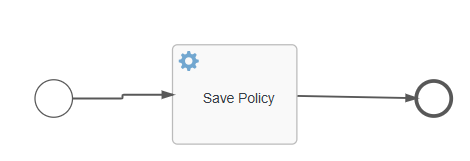

2. Claims Process

    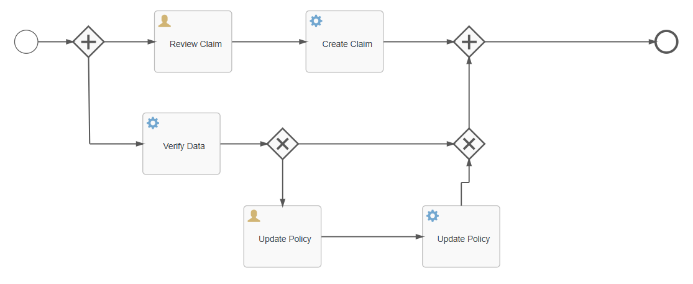

## Modelo de datos

Se crearon dos entidades para un modelo de datos personalizado llamado InsuranceDataModels

1. Policy

    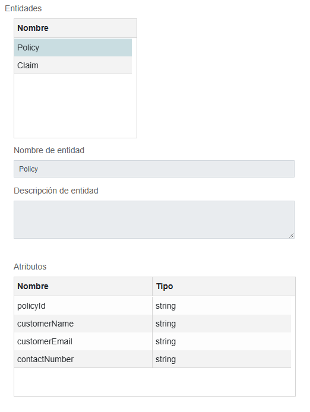

    propiedades de tipo string: policyId, customerName, customerEmail, customerNumber.

2. Claim

    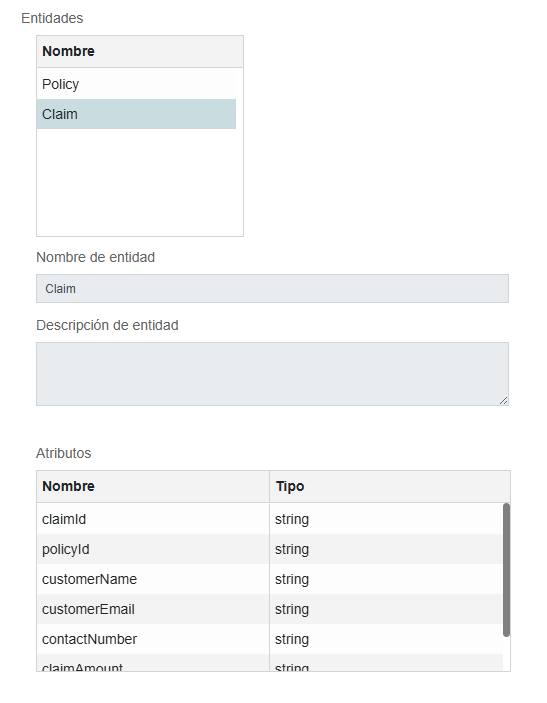

    propiedades de tipo string: claimId, policyId, customerName, customerEmail, customerNumber, claimAmount, contactNumberOnPolicy.
    
## Tabla de decisiones

Se creo una tabla de decisiones si ContactNumber del proceso de reclamo es diferente a lo almacenado en el proceso de póliza.

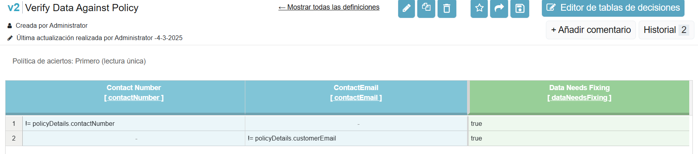

## Formularios

### CreatePolicy Form

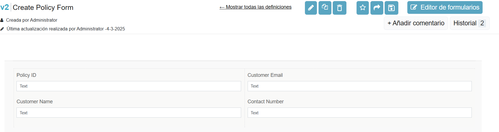

### Review Claim

Los valores a mostrar son de campos de formularios (PolicyId, Contact Number, Contact Email) y variables (policyDetails)

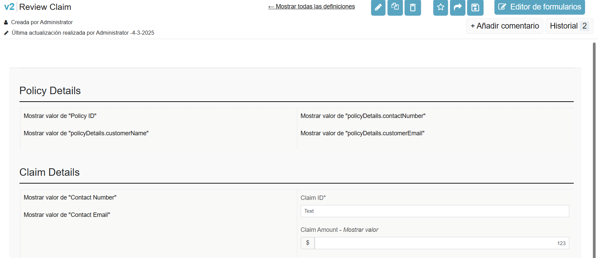

### Update Policy Form

Los valores a mostrar son de variables (policyDetails)

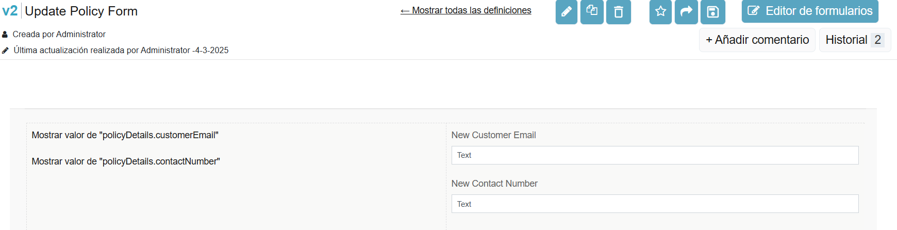

### New Claim Form

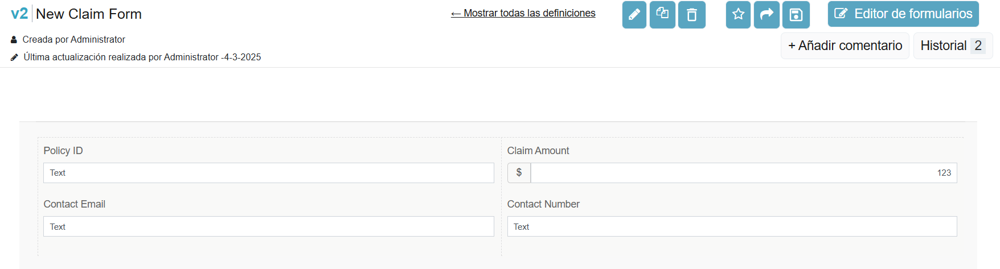

## Create Policy

1. El evento inicial crea el formulario **Create Policy Form**.

2. La actividad **Almacenar tarea de entidad** tiene la siguiente configuración de asignacion de atributos:

    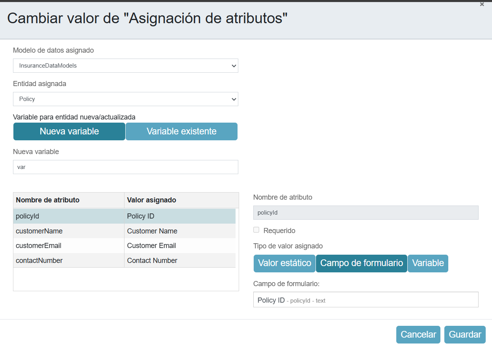

## Claim Process

1. El evento inicial crea el formulario **New Claim Form** y tiene la siguiente configuración de **asignaciones de campo de formulario a modlo de datos**: 

    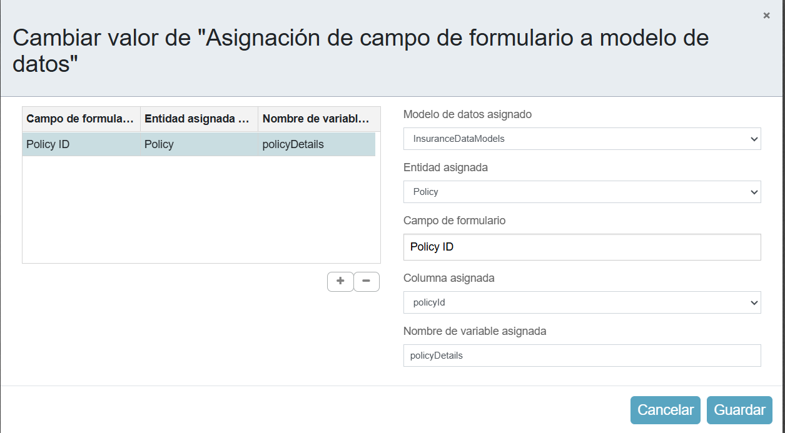

2. La tarea de usuario **Review Claim** implementa el formulario **Review Claim**.

3. Subsecuente a esta actividad esta el de **Create Claim** (almacenar tarea en entidad) con la siguiente configuración de asignacion de atributos:

    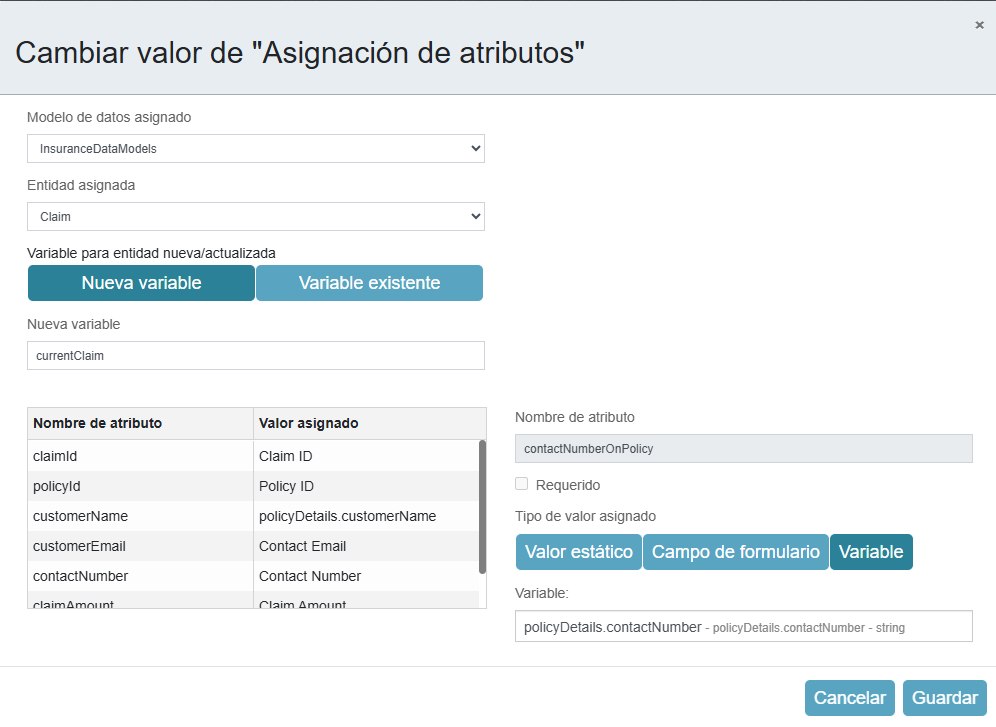
    
    En algunos casos son variables y otros campos de formulario.

4. Se crea una actividad de Tarea de decisiones con la tabla de decisiones creada previamente.

5. La puerta de enlace exclusiva valida que la variable dataNeedsFixing este seleccionada, si esta seleccionada va a **Update Policy**.

6. Que implementa el formulario **Update Policy Form**.

7. Subsecuente a esta actividad esta el de **Update Policy** (almacenar tarea en entidad) con la siguiente configuración de asignacion de atributos:

    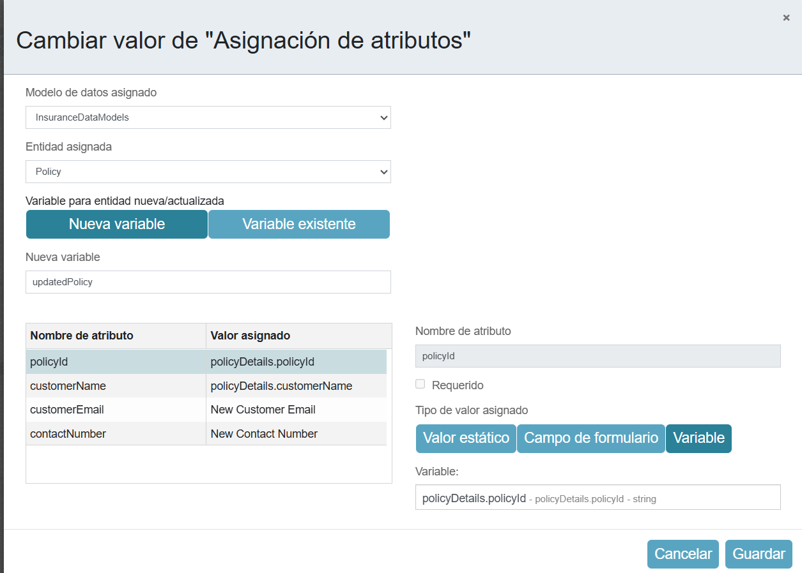
    
    En algunos casos son variables y otros campos de formulario.