# Campos de formulario personalizados

Se pueden agregar tipos de campos de formulario personalizados a través de plantillas de formulario personalizadas . Una plantilla de formulario se basa en la plantilla de formulario predeterminada y se pueden eliminar, reordenar, modificar (cambiar el nombre, el icono, etc.) o tener nuevos tipos de campos de formulario.

Las plantillas de formulario se definen en la sección Plantillas del Diseñador de aplicaciones. Un nuevo tipo de campo de formulario consta de lo siguiente:

- Una plantilla HTML que se representa al arrastrar y soltar desde la paleta en el **lienzo del formulario** es el generador de formularios.
- Una plantilla HTML que se representa cuando el formulario se muestra en **tiempo de ejecución**.
Un controlador AngularJS personalizado opcional en caso de que sea necesario **aplicar lógica** personalizada al campo de formulario.
- Una lista opcional de **scripts de terceros** que se necesitan cuando se trabaja con el campo de formulario en tiempo de ejecución.


# Ejemplos 

Para los siguientes ejemplos:

1. Crear una plantilla

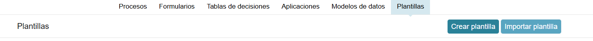

2. Datos de la plantilla

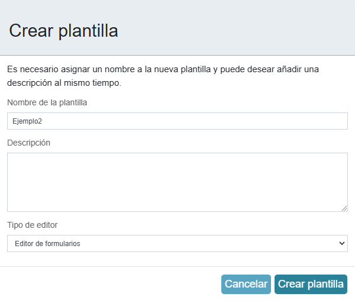

3. Editor de plantillas


4. Añadir nuevo elemento

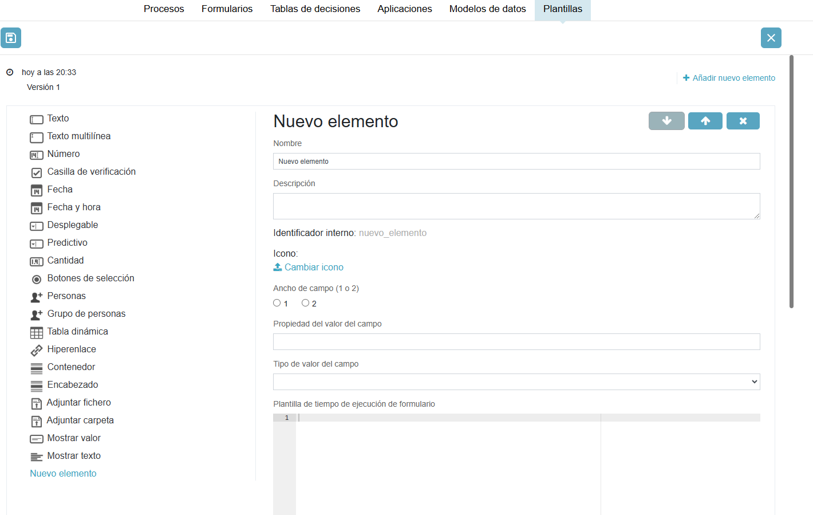

## Ejemplo 1

Para realizar el ejemplo hay que navegar a: 

Plantillas > Crear Plantilla (Editor de formularios) > Editor de Plantillas > Añadir nuevo elemento


Este ejemplo contiene una lista de campos numéricos con un botón en la parte inferior para agregar una nueva línea de elementos, mientras se genera un gráfico circular al a derecha.

Este elemento se llamará **Gráfico**

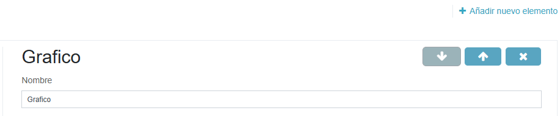

Se utilizaré la biblioteca Epoch, descarga los siguiente archivos desde su sitio de github:

- [d3.min.js](https://raw.githubusercontent.com/mbostock/d3/v3.5.6/d3.min.js)
- [epoch.min.js](https://raw.githubusercontent.com/fastly/epoch/0.6.0/epoch.min.js)

>**Nota**: ya que la biblioteca epoch depende de d3, entonces d3 debe estar primero en la tabla y epoch en segundo lugar.

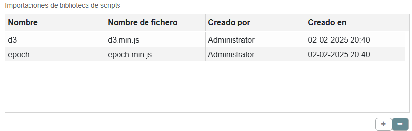

en **Plantilla de editor de formulario**

```html

```


en **Plantilla de tiempo de ejecución de formulario**

```html
<link rel="stylesheet" type="text/css" href="https://cdnjs.cloudflare.com/ajax/libs/epoch/0.6.0/epoch.min.css">

<div ng-controller="MyController" style="float:left;margin: 35px 20px 0 0;">
    <div ng-repeat="item in items">
          <input type="text" ng-model="item.label" style="width:200px; margin: 0 10px 10px 0;" ng-change="refreshChart()">
          <input type="number" ng-model="item.value" style="width: 80px; margin-bottom: 10px;" ng-change="refreshChart()">
    </div>

    <div>
        <button class="btn btn-default btn-sm" ng-click="addItem()" ng-disabled="isDisabled">
           Add item
        </button>
    </div>
</div>

<div class="epoch category10" ng-class="'activiti-chart-' + field.id" style="display:inline-block;width: 200px; height: 200px;"></div>
<div class="clearfix"></div>

```
Este fragmento de código combina HTML, AngularJS y la librería Epoch para mostrar y actualizar dinámicamente un gráfico de pastel (pie chart) basado en una lista de elementos. A continuación se explica cada parte:

---

### 1. Inclusión del CSS de Epoch

```html
<link rel="stylesheet" type="text/css" href="https://cdnjs.cloudflare.com/ajax/libs/epoch/0.6.0/epoch.min.css">
```

- Se carga el archivo CSS de la versión 0.6.0 de Epoch desde un CDN (cdnjs). Esto es necesario para aplicar el estilo y la apariencia del gráfico generado por Epoch.

---

### 2. Controlador AngularJS y edición de elementos

```html
<div ng-controller="MyController" style="float:left;margin: 35px 20px 0 0;">
    <div ng-repeat="item in items">
          <input type="text" ng-model="item.label" style="width:200px; margin: 0 10px 10px 0;" ng-change="refreshChart()">
          <input type="number" ng-model="item.value" style="width: 80px; margin-bottom: 10px;" ng-change="refreshChart()">
    </div>

    <div>
        <button class="btn btn-default btn-sm" ng-click="addItem()" ng-disabled="isDisabled">
           Add item
        </button>
    </div>
</div>
```

- **ng-controller="MyController"**: Asigna el controlador `MyController` a este bloque de HTML. Este controlador gestiona la lógica de los datos y el gráfico.
- **ng-repeat="item in items"**: Itera sobre el arreglo `items` (definido en el controlador), generando una sección para cada elemento.
  - **input type="text"**: Permite editar la propiedad `label` de cada elemento. Al cambiar su valor, se llama a la función `refreshChart()`, que actualiza el gráfico.
  - **input type="number"**: Permite editar la propiedad `value` de cada elemento. También llama a `refreshChart()` al modificar su valor.
- **Botón "Add item"**:  
  - Al hacer clic, se invoca la función `addItem()` definida en el controlador, lo que añade un nuevo elemento al arreglo.
  - El atributo **ng-disabled="isDisabled"** desactiva el botón cuando la variable `isDisabled` es `true`.

---

### 3. Contenedor del gráfico de pastel

```html
<div class="epoch category10" ng-class="'activiti-chart-' + field.id" style="display:inline-block;width: 200px; height: 200px;"></div>
```

- **class="epoch category10"**: Estas clases son utilizadas por la librería Epoch para determinar el estilo y la categoría de colores (en este caso, "category10" es una paleta de 10 colores).
- **ng-class="'activiti-chart-' + field.id"**: Utiliza AngularJS para asignar dinámicamente una clase al contenedor. Se concatena la cadena `'activiti-chart-'` con el valor de `field.id` (definido en el scope), lo que permite identificar de forma única este gráfico dentro del DOM.
- **Estilos inline**: Se definen el ancho y alto del contenedor (200px por 200px), lo que establece el tamaño del gráfico.

---

### 4. Limpieza de floats

```html
<div class="clearfix"></div>
```

- La clase **clearfix** se utiliza para limpiar los floats, asegurando que los elementos flotantes anteriores (como el div del controlador que tiene `float:left`) no afecten la disposición de los elementos posteriores en la página.

---

### Resumen

- **CSS de Epoch**: Se carga para dar estilo al gráfico.
- **Bloque con `ng-controller`**: Permite la edición dinámica de un arreglo de elementos (cada uno con una etiqueta y un valor) que se mostrarán en el gráfico.
- **ng-repeat**: Genera inputs para cada elemento en el arreglo, permitiendo actualizar el gráfico en tiempo real mediante la función `refreshChart()`.
- **Botón "Add item"**: Permite agregar nuevos elementos, mientras que su estado se controla con `ng-disabled`.
- **Contenedor del gráfico**: Se identifica mediante clases estáticas y dinámicas y se define su tamaño, permitiendo a la librería Epoch renderizar el gráfico de pastel con los datos proporcionados.

Esta integración entre AngularJS y Epoch permite que, al modificar los valores o agregar nuevos elementos, el gráfico se actualice automáticamente para reflejar los cambios en los datos.

Definir el controlador para este campo de formulario. El controlador es un controlador **AngularJs** que realiza principalmente tres funciones:

- Mantener un modelo de los artículos de línea
- Implementar una devolución de llamada para el botón en el que se puede hacer clic
- Almacene el valor del campo de formulario en el formato adecuado de Process Services

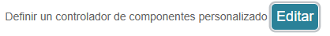

```Javascript
angular.module('activitiApp')
    .controller('MyController', ['$rootScope', '$scope', function ($rootScope, $scope) {

        console.log('MyController instantiated');

        // Items are empty on initialisation
        $scope.items = [];

        // The variable to store the piechart data (non angular)
        var pieChart;

        // Epoch can't use the Angular model, so we need to clean it
        // (remove hashkey etc, specific to Angular)
        var cleanItems = function(items) {
            var cleanedItems = [];
            items.forEach(function(item) {
               cleanedItems.push( { label: item.label, value: item.value} );
            });

            return cleanedItems;
        };

        // Callback for the button
        $scope.addItem = function() {

            // Update the model
            $scope.items.push({ label: 'label ' + ($scope.items.length + 1), value: 0 });

            // Update the values for the pie chart
            // Note: Epoch is not an angular lib so doesn't use the model directly
            if (pieChart === undefined) {

                pieChart = jQuery('.activiti-chart-' + $scope.field.id).epoch({
                    type: 'pie',
                    data: cleanItems($scope.items)
                });
                console.log('PieChart created');

            } else {

                $scope.refreshChart();

            }

        };


        // Callback when model value changes
        $scope.refreshChart = function() {
            pieChart.update(cleanItems($scope.items));
            console.log('PieChart updated');
        };


        // Register this controller to listen to the form extensions methods
        $scope.registerCustomFieldListener(this);

        // Deregister on form destroy
        $scope.$on("$destroy", function handleDestroyEvent() {
            console.log("destroy event");
            $scope.removeCustomFieldListener(this);
        });

        // Setting the value before completing the task so it's properly stored
        this.formBeforeComplete = function(form, outcome, scope) {
            console.log('Before form complete');
            $scope.field.value = JSON.stringify(cleanItems($scope.items));
        };

        // Needed when the completed form is rendered
        this.formRendered = function(form, scope) {
            console.log(form);
            form.fields.forEach(function(field) {
                if (field.type === 'readonly'
                      && $scope.field.id == field.id
                      && field.value
                      && field.value.length > 0) {

                    $scope.items = JSON.parse(field.value);
                    $scope.isDisabled = true;

                    pieChart = jQuery('.activiti-chart-' + $scope.field.id).epoch({
                        type: 'pie',
                        data: cleanItems($scope.items)
                    });

                }
            });
        };

}]);
```
El siguiente código define un controlador AngularJS dentro del módulo `activitiApp`. A continuación se explica cada parte en detalle:

---

### 1. Definición del controlador y dependencias

```javascript
angular.module('activitiApp')
    .controller('MyController', ['$rootScope', '$scope', function ($rootScope, $scope) {
```

- **angular.module('activitiApp')**: Se utiliza para acceder al módulo de la aplicación.
- **.controller('MyController', [...])**: Se declara un controlador llamado `MyController` inyectando las dependencias `$rootScope` y `$scope`.
- **console.log('MyController instantiated');**: Se imprime un mensaje en la consola para confirmar que el controlador se ha creado.

---

### 2. Inicialización de variables

```javascript
$scope.items = [];
var pieChart;
```

- **$scope.items = []**: Se inicializa un arreglo vacío que almacenará los elementos (por ejemplo, datos para un gráfico de pastel).
- **var pieChart;**: Variable para almacenar la instancia del gráfico de pastel que se crea usando una librería externa (Epoch), la cual no está integrada con AngularJS.

---

### 3. Función para limpiar los datos

```javascript
var cleanItems = function(items) {
    var cleanedItems = [];
    items.forEach(function(item) {
       cleanedItems.push({ label: item.label, value: item.value });
    });
    return cleanedItems;
};
```

- **cleanItems**: Es una función que recibe un arreglo de elementos y devuelve un nuevo arreglo que contiene únicamente las propiedades `label` y `value` de cada elemento.  
- Esto es útil para eliminar propiedades internas que AngularJS añade (como `$$hashKey`) y que no se desean enviar a la librería del gráfico.

---

### 4. Función para agregar un ítem

```javascript
$scope.addItem = function() {
    // Actualiza el modelo agregando un nuevo ítem
    $scope.items.push({ label: 'label ' + ($scope.items.length + 1), value: 0 });

    // Actualiza los datos para el gráfico de pastel
    if (pieChart === undefined) {
        pieChart = jQuery('.activiti-chart-' + $scope.field.id).epoch({
            type: 'pie',
            data: cleanItems($scope.items)
        });
        console.log('PieChart created');
    } else {
        $scope.refreshChart();
    }
};
```

- **$scope.addItem**: Función que se invoca cuando se pulsa un botón (por ejemplo, para agregar un nuevo dato al gráfico).  
- Se añade un nuevo elemento al arreglo `$scope.items` con un label dinámico y valor inicial 0.
- Si `pieChart` aún no se ha creado, se instancia utilizando la librería **Epoch** sobre un elemento HTML cuyo selector se construye con la clase `activiti-chart-` concatenado con el id del campo (`$scope.field.id`).  
- Si el gráfico ya existe, se llama a la función `refreshChart` para actualizarlo.

---

### 5. Función para refrescar el gráfico

```javascript
$scope.refreshChart = function() {
    pieChart.update(cleanItems($scope.items));
    console.log('PieChart updated');
};
```

- **$scope.refreshChart**: Se encarga de actualizar el gráfico de pastel con los datos limpios obtenidos a partir de `$scope.items`.

---

### 6. Registro y desregistro del controlador como listener

```javascript
$scope.registerCustomFieldListener(this);
$scope.$on("$destroy", function handleDestroyEvent() {
    console.log("destroy event");
    $scope.removeCustomFieldListener(this);
});
```

- **$scope.registerCustomFieldListener(this);**: Registra el controlador como listener para eventos personalizados en el formulario.  
- **$scope.$on("$destroy", ...)**: Cuando el scope se destruye (por ejemplo, al salir de la vista), se ejecuta esta función que elimina el listener registrado, evitando posibles pérdidas de memoria o comportamientos inesperados.

---

### 7. Métodos para manipular el comportamiento del formulario

#### a. Antes de completar el formulario

```javascript
this.formBeforeComplete = function(form, outcome, scope) {
    console.log('Before form complete');
    $scope.field.value = JSON.stringify(cleanItems($scope.items));
};
```

- **formBeforeComplete**: Este método se invoca justo antes de que se complete la tarea/formulario.
- Convierte el arreglo limpio de ítems a una cadena JSON y lo asigna a `$scope.field.value`, de modo que se almacene correctamente el valor en el formulario.

#### b. Cuando el formulario se ha renderizado

```javascript
this.formRendered = function(form, scope) {
    console.log(form);
    form.fields.forEach(function(field) {
        if (field.type === 'readonly'
              && $scope.field.id == field.id
              && field.value
              && field.value.length > 0) {

            $scope.items = JSON.parse(field.value);
            $scope.isDisabled = true;

            pieChart = jQuery('.activiti-chart-' + $scope.field.id).epoch({
                type: 'pie',
                data: cleanItems($scope.items)
            });
        }
    });
};
```

- **formRendered**: Se ejecuta cuando el formulario ya se ha renderizado.
- Itera sobre cada campo del formulario (`form.fields`) y, si encuentra un campo de solo lectura que coincide con el id del campo en el scope y que tiene un valor, se parsea ese valor (asumiendo que es JSON) para asignarlo a `$scope.items`.  
- Además, establece `$scope.isDisabled = true` para deshabilitar el campo (esto podría usarse en la vista con `ng-disabled`), y vuelve a crear el gráfico de pastel utilizando los datos actualizados.

---

### Resumen

Este controlador se encarga de gestionar una lista de ítems que se muestran en un gráfico de pastel (utilizando la librería Epoch). Permite agregar nuevos ítems, actualizar el gráfico y sincronizar los datos del modelo con el formulario antes de completarlo. Además, se registra como listener para recibir eventos del formulario y se asegura de limpiar y actualizar los datos adecuadamente cuando se renderiza o se destruye el scope.

Los campos de Propiedad y tipo de valor de campo es para agregar un nuevo par de clave:valor a customFieldsValueInfo.FieldName (ex customFieldsValueInfo.grafico )

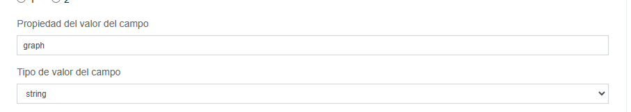

En el form renderizado 

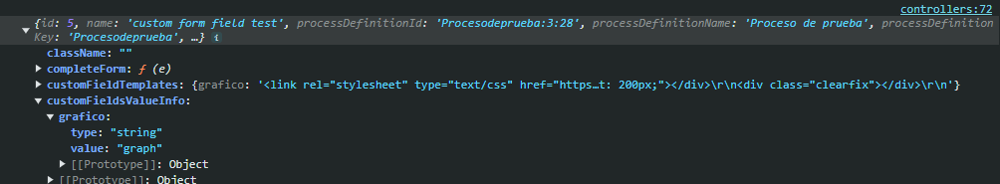


``$scope.field.value`` es igual a Field value type. 


## Ejemplo 2

Campo Mes presentado como un menú desplegable donde el usuario final puede seleccionar un mes. Campo estatico y no implica datos dinámicos.

Plantillas > Crear Plantilla (Editor de formularios) > Editor de Plantillas > Añadir nuevo elemento

1. Creamos el campo como lo muestran las siguientes imagenes, esto Obliga a que el campo tenga el id **selectedMonth**.

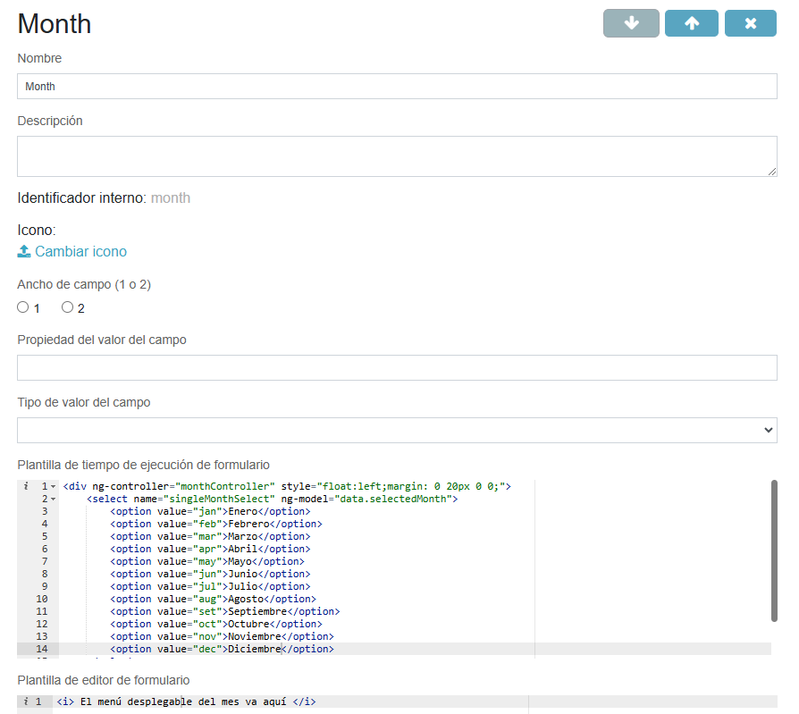

```html
<div ng-controller="monthController" style="float:left;margin: 0 20px 0 0;">
    <select name="singleMonthSelect" ng-model="data.selectedMonth">
        <option value="jan">Enero</option>
        <option value="feb">Febrero</option>
        <option value="mar">Marzo</option>
        <option value="apr">Abril</option>
        <option value="may">Mayo</option>
        <option value="jun">Junio</option>
        <option value="jul">Julio</option>
        <option value="aug">Agosto</option>
        <option value="set">Septiembre</option>
        <option value="oct">Octubre</option>
        <option value="nov">Noviembre</option>
        <option value="dec">Diciembre</option>
    </select>
</div>
```

```html
<i> El menú desplegable del mes va aquí </i>
```

```javascript
angular
.module('activitiApp')
//El siguiente código adjunta este controlador al marcado HTML que acabamos de crear 
.controller('monthController',
    ['$rootScope', '$scope', 
    // indica la implementación del controlador
    function($rootScope, $scope){
        $scope.data={ selectedMonth : null,};
        
        ALFRESCO.formExtensions.formBeforeComplete =
            function(form, outcome, scope){
                console.log('Before form complete');
                console.log('$scope');
                console.log($scope.field); // hace referencia al field donde se definio el controlador.
                $scope.field.value = $scope.data.selectedMonth
            };
    }]
);
```

Probamos creando una aplicación con la plantilla de formulario creada.

>**Nota** : el campo creado tiene que tener el id ``selectedMonth``.

## Ejemplo 3

Menú desplegable con una lista de datos de un servicio externo. El servicio externo es el api de pokemon:


```url
https://pokeapi.co/api/v2/pokemon?limit=10&offset=0
```

```json
{
  "count": 1304,
  "next": "https://pokeapi.co/api/v2/pokemon?offset=10&limit=10",
  "previous": null,
  "results": [
    {
      "name": "bulbasaur",
      "url": "https://pokeapi.co/api/v2/pokemon/1/"
    },
    {
      "name": "ivysaur",
      "url": "https://pokeapi.co/api/v2/pokemon/2/"
    },
    {
      "name": "venusaur",
      "url": "https://pokeapi.co/api/v2/pokemon/3/"
    },
    {
      "name": "charmander",
      "url": "https://pokeapi.co/api/v2/pokemon/4/"
    },
    {
      "name": "charmeleon",
      "url": "https://pokeapi.co/api/v2/pokemon/5/"
    },
    {
      "name": "charizard",
      "url": "https://pokeapi.co/api/v2/pokemon/6/"
    },
    {
      "name": "squirtle",
      "url": "https://pokeapi.co/api/v2/pokemon/7/"
    },
    {
      "name": "wartortle",
      "url": "https://pokeapi.co/api/v2/pokemon/8/"
    },
    {
      "name": "blastoise",
      "url": "https://pokeapi.co/api/v2/pokemon/9/"
    },
    {
      "name": "caterpie",
      "url": "https://pokeapi.co/api/v2/pokemon/10/"
    }
  ]
}
```
Formulario en tiempo de ejecución

```html
<div ng-controller="pokeController" style="float:left;margin: 0 20px 0 0;">
    <select ng-model="data.selectedPokemon"
        ng-options="item.code as item.name for item in data.pokemones">
        <option value="">--Select Pokemon--</option>
    </select>
    
</div>
```

Controlador del formulario

```javascript
angular.module('activitiApp')
.controller('pokeController', 
    ['$rootScope', '$scope', '$http',  
    function ($rootScope, $scope, $http) {       
        $scope.data = {
            selectedPokemon: null,           
            pokemones: null  };            
        // Fetch all the states from an external REST service       
        // that responds with JSON       
        $http.get('https://pokeapi.co/api/v2/pokemon?limit=10&offset=0').
            then(
                function(data, status, headers, config) {               
                var tempResponseArray = data.data.results;               
                $scope.data.pokemones = [];                   
                    for (var i = 0; i < tempResponseArray.length; i++) {                   
                        var pokemon = { name: tempResponseArray[i].name, code: i};                   
                        $scope.data.pokemones.push(pokemon);                   
                    }               
                },
                function(data, status, headers, config) {                   
                            alert('Error: '+ status);                   
                            tempResponseArray = [];           
                }
            );                 
            
            // Setting the value before completing the task so it's properly stored       
            ALFRESCO.formExtensions.formBeforeComplete = function(form, outcome, scope){               
                $scope.field.value = $scope.data.selectedPokemon;           
            };       
        }
    ]
);
```

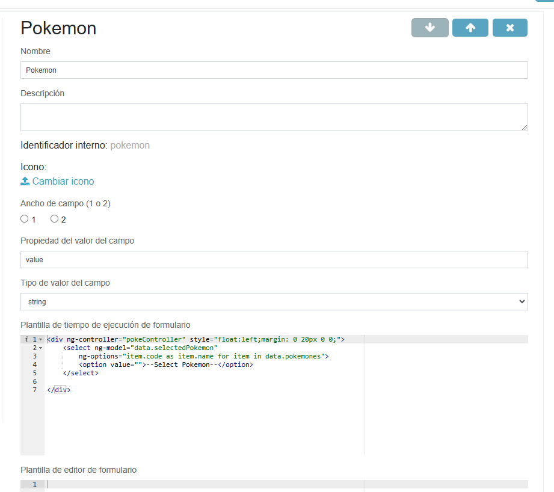


>**Nota** : el campo creado tiene que tener el id ``selectedPokemon``.
## Ejemplo 4

Implementación de un campo de formulario de imagen con hipervínculo. En el cual este campo necesita de parametros adicionales para configurar el campo que se incluye en el formulario.

Plantilla de tiempo de ejecución de formulario

```html
<a href="{{field.params.customProperties.hyperlinkUrl}}" target="_blank">
    
</a>
```

Plantilla de editor de formulario

```html
<i>La imagen con hipervinculo se mostrará aqui</i>
```

Tenemos dos propiedades: ``hyperlinkUrl`` y ``imageUrl``


El siguiente paso es definir los dos parámetros de configuración. Haga clic en el enlace Editar en la parte inferior de la pantalla de creación de campos:

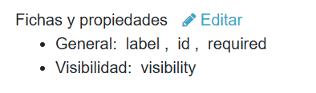


En la siguiente ventana, hacemos click en ``Añadir nueva propiedad``


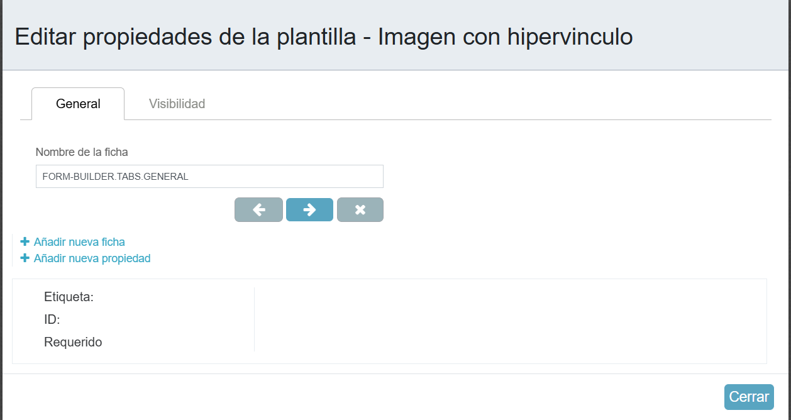


Para ``Para hyperlinkUrl``:


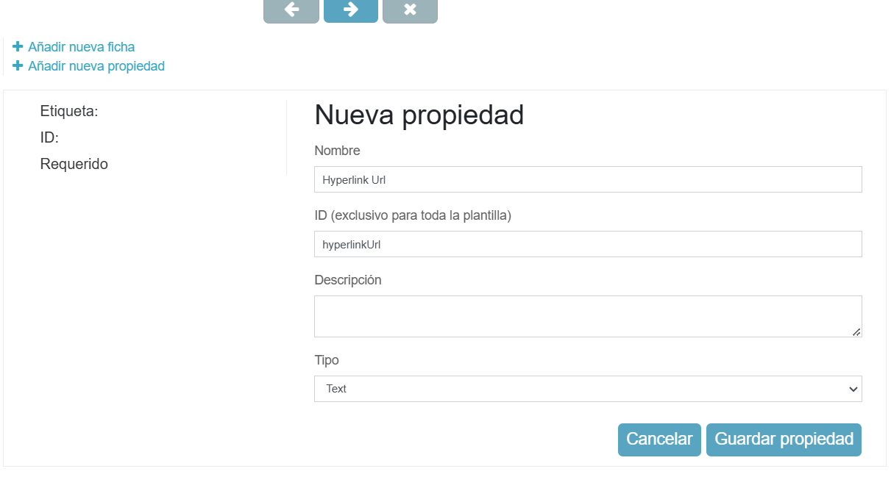


Para ``Para imageUrl``:


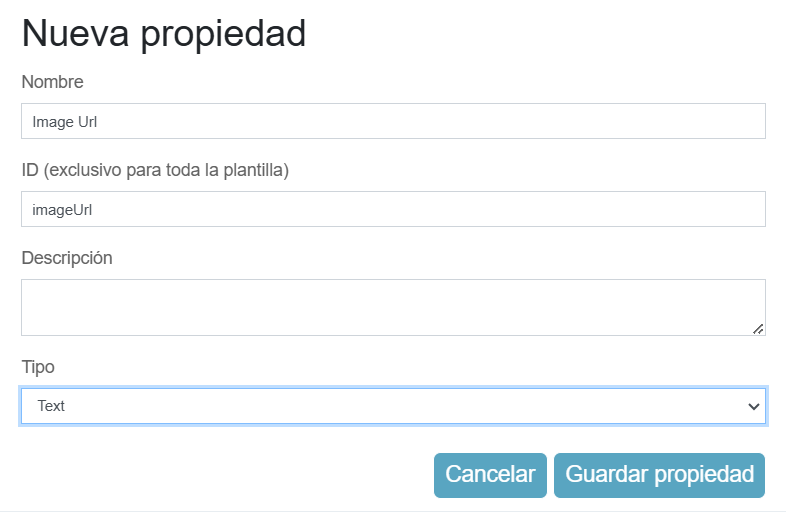

