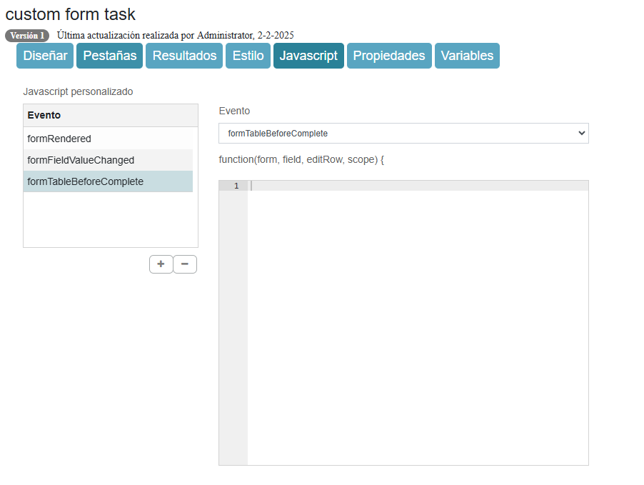

# Personalización del formulario de tarea

Los formularios de inicio y de tareas que forman parte de una vista de tareas se pueden personalizar para requisitos específicos. El siguiente ejemplo de código JavaScript proporciona una descripción general de todos los eventos de formularios y campos de formularios que se pueden usar para implementar lógica personalizada.

De forma predeterminada, el nombre del archivo *render-form-extensions.js* de la carpeta *workflow/extensions* esta presente y se carga en el *workflow/index.html* de la carpeta *workflow*. Tiene métodos vacios de forma predeterminada.


```javascript
var ALFRESCO = ALFRESCO || {};

ALFRESCO.formExtensions = {

    // Este método se invoca cuando se han representado los campos del formulario
    formRendered:function(form, scope) {
    },

    // Este método se invoca cuando cambian los valores de entrada (función ng-change)
    formFieldValueChanged:function(form , field, scope) {
    },

    // Este método se invoca cuando un campo de entrada obtiene el foco (evento de foco con la función ng-focus)
    formFieldFocus:function(form, field, scope) {
    },

    // Este método se invoca cuando un campo de entrada obtiene el foco (evento de foco con la función ng-focus) El campo de entrada ha perdido el foco (evento de desenfoque con la función ng-blur)
    formFieldBlur:function(form, field, scope) {
    },

    // Este método se invoca cuando se ha seleccionado una persona en el selector de personas
    formFieldPersonSelected:function(form, field , scope) {
    },

    // Este método se invoca cuando se ha enviado un correo electrónico. rellenado en el selector de personas
    formFieldPersonEmailSelected:function(form, field, scope) {
    },

    // Este método se invoca cuando se ha eliminado una persona en el selector de personas
    formFieldPersonRemoved:function(form, field, scope) {
    },

    // Este método se invoca cuando se ha seleccionado un grupo en el selector de grupos funcionales
    formFieldGroupSelected:function(form, field, scope) {
    },

    // Este método se invoca cuando se ha eliminado un grupo en el selector de grupos funcionales
    formFieldGroupRemoved:function( form, field, scope) {
    },

    // Este método se invoca cuando se ha cargado contenido en el campo de carga
    formFieldContentUploaded:function(form, field, scope) {
    },

    // Este método se invoca cuando se ha eliminado contenido en el campo de carga campo de carga
    formFieldContentRemoved:function(form, field, scope) {
    },

    // Este método se invoca cuando los valores REST o el conjunto están en un campo desplegable, de radio o de escritura anticipada
    formFieldRestValuesSet:function(form, field, scope) {
    },

    // Este método se invoca cuando se completa el botón o se establece un resultado se ha hecho clic y antes de que se complete la tarea. 
    formBeforeComplete:function(form, outcome, scope) {
    },

    // Este método se invoca cuando los valores de entrada cambian (función ng-change) en una tabla dinámica
    formTableFieldValueChanged:function(form, field, columnDefinition, editRow, scope) {
    }, 
    
    // Este método se invoca cuando un campo de entrada obtiene el foco (evento de foco con la función ng-focus) en una tabla dinámica
    formTableFieldFocus:function(form, field, columnDefinition, editRow, scope) {
    },

    // Este método se invoca cuando un campo de entrada obtiene el foco (evento de foco con la función ng-focus) en una tabla dinámica
    //El campo de entrada ha perdido el foco (evento de desenfoque con la función ng-blur) en una tabla dinámica
    formTableFieldBlur:function(form, field, columnDefinition, editRow, scope) {
    },

    // Este método se invoca cuando los valores REST o el conjunto en un menú desplegable campo en una tabla dinámica
    formTableFieldRestValuesSet:function(form, field, columnDefinition, editRow, scope) {
    },

    // Este método se invoca cuando los campos del formulario se han representado en la ventana emergente de la tabla dinámica
    formTableRendered:function(form, field, columnDefinition, editRow, scope) {
    },

    // Este método se invoca cuando se ha hecho clic en el botón de completar y antes de que se complete la ventana emergente de la tabla dinámica.
    formTableBeforeComplete:function(form, field, editRow, scope) {
    },

    // Este método se invoca cuando se ha hecho clic en el botón de cancelar y antes de que se complete la ventana emergente de la tabla dinámica. La ventana emergente de la tabla se cancela.
    formTableBeforeCancel:function(form, field, editRow, scope) {
    },

    // Este método se invoca cuando cambian los valores de entrada (función ng-change) y deshabilitará los botones completos cuando se devuelva falso (booleano).
    formValidateFieldValueChanged:function(form, field, scope) {
    },

    // Este método se invoca cuando se hace clic en el botón de completar y evitará que se complete el formulario cuando se devuelva falso (booleano).
    formValidateBeforeSubmit:function(form, outcome, scope) {
    },

    // Este método se invoca cuando cambian los valores de entrada (función ng-change) en una tabla dinámica y deshabilitará el botón Guardar cuando se devuelva falso (booleano).
    formTableValidateFieldValueChanged:function(form, field, columnDefinition, editRow, scope ) {
    },

    // Este método se invoca cuando se hace clic en el botón Completar y antes de que se complete la ventana emergente de la tabla dinámica y evita que se complete el formulario.
    // Cuando es falso (booleano) se devuelve. 
    formTableValidateBeforeComplete:function(form, field, editRow, scope) {
    },

    // Este método se invoca cuando una tarea se completa con éxito
    taskCompleted:function(taskId, form, scope) {
    },

    // Este método se invoca cuando una tarea se completa sin éxito.
    taskCompletedError:function(taskId, errorResponse, form, scope) {
    },

    // Este método se invoca cuando una tarea se guarda correctamente
    taskSaved:function(taskId, form, scope) {
    },

    // Este método se invoca cuando una tarea se guarda sin éxito.
    taskSavedError:function(taskId, errorResponse, form, scope) {
    }
};
```

## Ejemplos

para realizar los ejemplos es necesario crear un formulario y en la opción **javascript** seleccionar el evento y programar la logica.



### 1. para obtener el usuario actual:

```javascript
formRendered:function(form, scope) {
    var currentUser = scope.$root.account;
    console.log(currentUser);
}
```

### 2. Bloque a un campo si otro campo ha sido seleccionado

```javascript
formFieldValueChanged:function(form, field, scope) {
    if (field.id === 'tipoSolicitud' && field.value === 'Urgente') { // Reemplaza con el ID del campo a monitorear.
        form.fields['comentario'].readOnly = true; // Reemplaza con el ID del campo a bloquear.
    } else {
        form.fields['comentario'].readOnly = false;
    }
}
```

### 3. Solicite una confirmación

```javascript
formBeforeComplete:function(form, outcome, scope) {
    var confirmacion = confirm("¿Estás seguro de que deseas completar esta tarea?");
    return confirmacion; // Si el usuario presiona "Cancelar", se evita completar la tarea.
}
```

### 4. Autocompletar un campo de fecha con la fecha actual

```javascript
formRendered:function(form, scope) {
    var today = new Date().toISOString().split('T')[0]; // Formato YYYY-MM-DD.
    form.values['fechaSolicitud'] = today; // Reemplaza con el ID del campo de fecha.
}
```

## Extensiones de interfaz de usuario


> **Nota:** La información a continuación se aplica a la extensión de la interfaz de usuario de AngularJS disponible en APS. El **Alfresco Application Development Framework** y el **Process Workspace**, introducidos en APS 1.8, son ahora el mecanismo preferido para extender la interfaz de usuario de **Alfresco Process Services**.

### Guía General

- Comienza cada personalización simplemente usando `console.log` en el evento apropiado para registrar los detalles de lo que está disponible; se puede determinar una gran cantidad de información de esta manera:

    ```javascript
    console.log(scope.$root);
    console.log(scope);
    console.log(form);
    console.log(field);
    ```

- Registrar la variable ``Scope`` en la consola proporciona información sobre los objetos y funciones que se pueden usar en la extensión, por ejemplo, la función ``saveForm``, que podría usarse para guardar automáticamente el formulario en puntos clave.

- Registrar la variable ``Form`` en la consola proporciona información sobre el Proceso, Formulario y Variables disponibles.


### Recomendaciones

- Habilita las Herramientas para Desarrolladores de Chrome para ver la consola y otras herramientas útiles para depurar el proceso y las extensiones de la interfaz de usuario.

- Desarrolla extensiones de formularios realizando cambios en render-form-extensions.js en primera instancia; es mucho más fácil realizar cambios y depurar utilizando este enfoque en lugar de agregar la personalización a través de la pestaña JavaScript en el App Designer.

### Funciones Útiles

- Buscar un Campo en el Formulario
    ```javascript
    var theField = scope.findFormFieldWithId(scope, "fieldID");
    ```

- Mostrar un Mensaje de Error
    ```javascript
    scope.$root.addAlert('Texto de alerta', 'error');
    scope.$root.addAlert('Texto de alerta', 'info');
    ```

### Tabla dinamica

La Tabla Dinámica ha sido implementada utilizando UI Grid, disponible en: http://ui-grid.info/. En este sitio web se puede encontrar más información sobre los métodos y hooks disponibles.


