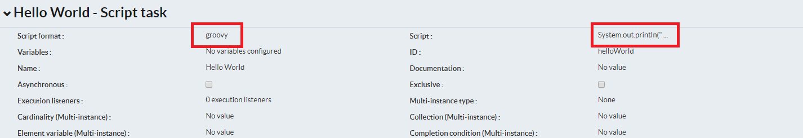
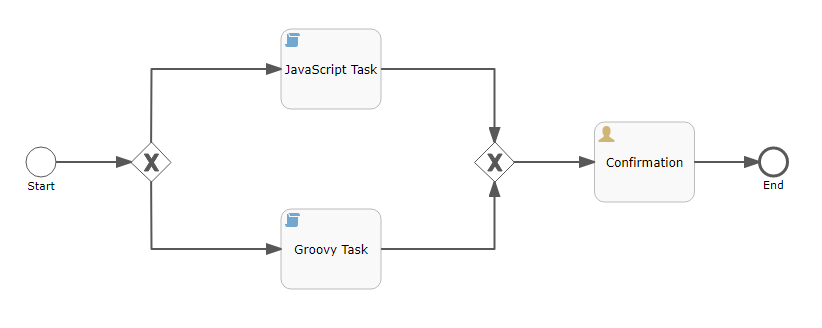
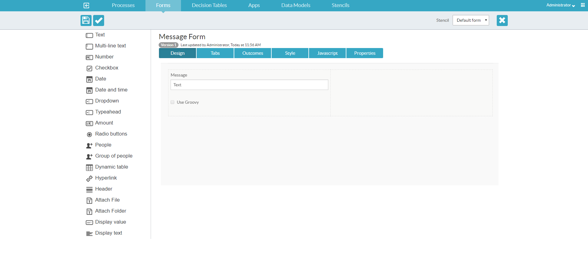
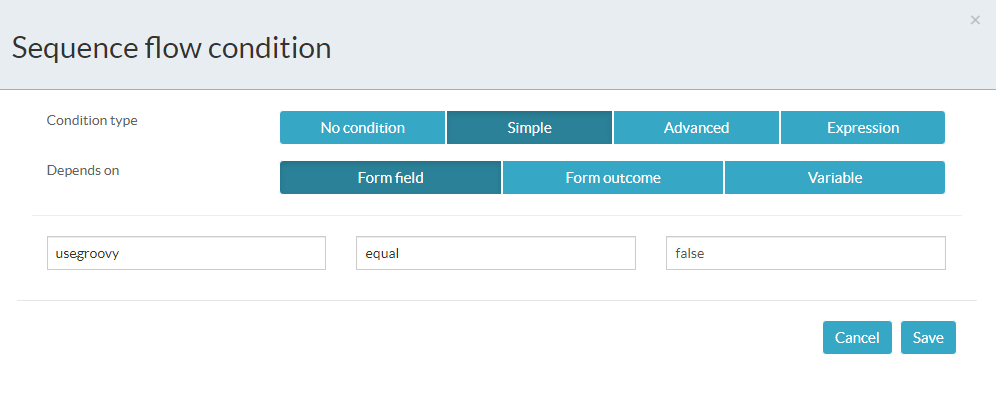
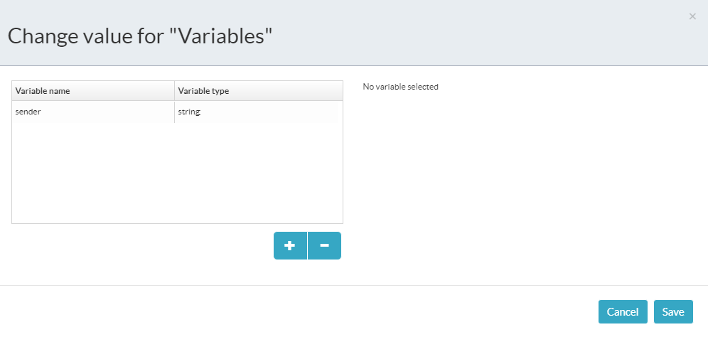

# Personalización de ScriptTask

Un script Task es: 
- Una actividad automatizada o automática
- Escrita con un lenguaje javascript como javascript o groovy.
- Interpretada en tiempo de ejecución



- Name : Hello Wolrd
- Script Format: groovy
- Script: System.out.println("Hello World");

Es útil para envio de usuario, Acceso a recursos externos para crear un pedido y envío de la entrega. Se deberia usar cuando es una sola tarea, hay limititaciones para desplegar código y no necesitas acceso a la API ó se necesita un prototipo rápido.


Por defecto para activar los script task e incluso en el lenguaje groovy utilizamos las siguientes propiedades:

```properties
# Disable scripting
validator.editor.bpmn.disable.scripttask=false
validator.editor.bpmn.disable.scripttask.groovy=false
```

## Creación de un spring bean scriptTask

En esta lección, utilizaremos uno de los beans de Spring de Alfresco Process Services junto con una tarea de script de Groovy y JavaScript para mostrar información al usuario.

El usuario podrá elegir qué tarea de script ejecutar.


### Creación del proceso

Agregue los siguientes elementos BPMN al nuevo proceso y conéctelos de la siguiente manera:
- Start Event
- Exclusive Gateway
- Script Task
- Script Task
- Exclusive Gateway
- User Task
- End Event




1. Creación del formulario inicial
    
    - Desde el Editor BPMN, seleccione el Evento de inicio  y luego seleccione Formulario referenciado en el panel de propiedades.
    - Cree un nuevo formulario llamado Formulario de mensaje.
    - Agregue un control de texto(Text) y un control de Casilla de verificación(Checkbox).
    - Edite el control de texto y cambie la etiqueta a ``Message``; cierre el cuadro de diálogo cuando haya terminado.
    - Edite el control de Casilla de verificación y cambie la etiqueta a ``Use Groovy``; cierre el cuadro de diálogo cuando haya terminado.

    


2. Crear condiciones de flujo de secuencia

    Una vez que el usuario haya seleccionado su preferencia de script, el modelo de proceso deberá actuar sobre esta información y enrutar el proceso de manera adecuada.

    Configuraremos los flujos de secuencia en la ``compuerta exclusiva`` para garantizar que el proceso se enrute correctamente. Se utilizará JavaScript en el primer flujo y Groovy en el segundo.

    - Seleccione el flujo de secuencia superior dejando la primera ``compuerta exclusiva``.

    - Haga clic en la propiedad ``Condición de flujo`` y seleccione ``Simple`` en el cuadro de diálogo que aparece.

    - Seleccione ``Form Field`` y luego seleccione ``usegroovy`` como campo de formulario, ``igual`` como operador y ``falso`` como valor.

    

    - Siga los mismos pasos para el flujo de secuencia inferior, pero configure el valor en la condición como verdadero.


3. Configuración de JavaScript Task

    Ahora necesitaremos proporcionar la lógica empresarial para la tarea de script de JavaScript; esto simulará el envío de un mensaje.

    - Seleccione la tarea de script de JavaScript.
    - Establezca la ``Script Format`` de script en ``javascript``.
    - Haga clic en la propiedad ``Variables`` y luego haga clic en el signo ``+`` para agregar una nueva variable. Establezca el nombre en ``sender`` y el tipo en ``string``.

    

    >**Nota**: La creación de esta variable permite utilizar la información más adelante en el proceso para completar un campo en un formulario de estado. El valor no estaría disponible en el menú desplegable necesario sin esta tarea.


    - Haga clic en la propiedad Script para abrir el editor de scripts y agregar el siguiente script (explicado a continuación):
        ```javascript
        var message = execution.getVariable('message');
        var user = userInfoBean.getCurrentUser();
        var fullName = user.getFirstName() + ' ' + user.getLastName();

        print('New Message From (JavaScript): ' + fullName);
        print(message);

        execution.setVariable('sender', fullName);
        execution.setVariable('message',message + ": created in JavaScript")
        ```
    
    > **Nota**: A continuación se explica cada línea del script (la tarea Groovy tiene los mismos pasos, pero se utiliza el lenguaje Groovy):

        - Cree una variable ``message`` y complétela con el valor del formulario de inicio.
        - Cree una variable llamada ``user`` y complétela con el valor del bean Spring User Info que se proporciona OOTB con APS
        - Cree una variable llamada ``fullName`` y complétela con el valor del objeto ``user`` utilizando los métodos ``getFirstName() + " " + getLastName()``. Esto suma las dos partes del nombre con un espacio en el medio.
        - Imprima el mensaje ``New Message From (JavaScript): <fullname>`` en la consola. La parte (JavaScript) se agrega para que no se vea la fuente del mensaje.
        - Imprima el valor del texto del formulario de inicio.
        - Complete la variable de proceso ``sender`` con el ``fullname`` creado anteriormente.
        - Actualice la variable de proceso ``message`` agregando la fuente del script como ``: created in JavaScript``.

    - Haga clic en Guardar para cerrar el editor de scripts.


4. Configuración de Groovy Task

    Ahora necesitaremos proporcionar la lógica empresarial para la tarea de script de Groovy; esto simulará el envío de un mensaje.

    - Seleccione la tarea de script de Groovy.
    - Establezca la ``Script Format`` de script en ``groovy``.
    - Haga clic en la propiedad ``Variables`` y luego haga clic en el signo ``+`` para agregar una nueva variable. Establezca el nombre en ``sender`` y el tipo en ``string``.

    

    > **Nota**: La creación de esta variable permite utilizar la información más adelante en el proceso para completar un campo en un formulario de estado. El valor no estaría disponible en el menú desplegable necesario sin esta tarea.


    - Haga clic en la propiedad ``Script`` para abrir el editor de scripts y agregar el siguiente script (explicado a continuación):
        ```groovy
        var message = execution.getVariable('message');
        var user = userInfoBean.getCurrentUser();
        var fullName = user.getFirstName() + ' ' + user.getLastName();

        print('New Message From (groovy): ' + fullName);
        print(message);

        execution.setVariable('sender', fullName);
        execution.setVariable('message',message + ": created in groovy")
        ```
    
    > **Nota**: A continuación se explica cada línea del script (la tarea Javascript tiene los mismos pasos, pero se utiliza el lenguaje Groovy):

        - Cree una variable ``message`` y complétela con el valor del formulario de inicio.
        - Cree una variable llamada ``user`` y complétela con el valor del bean Spring User Info que se proporciona OOTB con APS
        - Cree una variable llamada ``fullName`` y complétela con el valor del objeto ``user`` utilizando los métodos ``getFirstName() + " " + getLastName()``. Esto suma las dos partes del nombre con un espacio en el medio.
        - Imprima el mensaje ``New Message From (Groovy): <fullname>`` en la consola. La parte (Groovy) se agrega para que no se vea la fuente del mensaje.
        - Imprima el valor del texto del formulario de inicio.
        - Complete la variable de proceso ``sender`` con el ``fullname`` creado anteriormente.
        - Actualice la variable de proceso ``message`` agregando la fuente del script como ``: created in Groovy``.

    - Haga clic en Guardar para cerrar el editor de scripts.

5. Creación del mensaje de confirmación

    El modelo de proceso necesitará una forma de confirmar al usuario cuáles de las tareas de script se ejecutaron. Crearemos un formulario de confirmación para capturar la salida para este propósito.

    - Desde el editor BPMN, seleccione la tarea de confirmación de usuario y luego seleccione Formulario referenciado en el panel de propiedades.
    - Cree un nuevo formulario llamado Confirmación de mensaje.
    - Agregue un control Valor de visualización(Display Value).
    - Edite el control Texto para mostrar para reflejar lo siguiente:
        Mensaje enviado por ${sender}:
        ---
        ${message}

    > **Nota**: La sintaxis ${variable} se utiliza para generar el valor de una variable de proceso en el formulario.

    - Guarde y cierre el formulario.
    - Valide y luego guarde su nuevo proceso antes de regresar al Diseñador de aplicaciones.

    