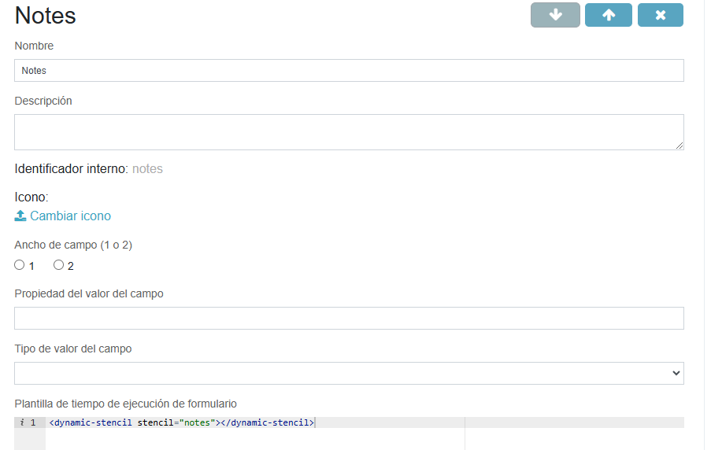
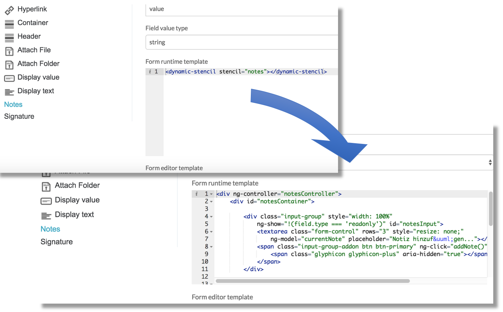

# Recursos Web Personalizados

Si desea agregar funciones adicionales de Javascript o anular reglas CSS, puede configurar una lista de recursos web adicionales que el navegador carga para cada aplicación de Process Service. Para ello, configure un nuevo recurso en la carpeta **tomcat/webapps/activiti-app**

A continuación se muestra un ejemplo de una nueva sección agregada al archivo **app-cfg.js** localizado en **tomcat/webapps/activiti-app/scripts**

```javascript
ACTIVITI.CONFIG.resources = {
    '*': [
        {
            'tag': 'link',
            'rel': 'stylesheet',
            'href': ACTIVITI.CONFIG.webContextRoot + '/custom/style.css?v=1.0'
        }
    ],
    'workflow': [
        {
            'tag': 'script',
            'type': 'text/javascript',
            'src': ACTIVITI.CONFIG.webContextRoot + '/custom/javascript.js?v=1.0'
        }
    ]
};
```

El objeto **ACTIVITI.CONFIG.resources** permite cargar distintos archivos para cada una de las aplicaciones Activiti utilizando sus nombres como clave para una lista de recursos adicionales que se cargarán; los distintos nombres de las aplicaciones son: **landing** , **analytics** , **editor** , **idm** y **workflow** . La clave * significa que se utilizará una lista de recursos predeterminada a menos que haya una clave de configuración específica para la aplicación que se cargará.

Por ejemplo, si un usuario ingresa a la aplicación de **editor** , con la configuración anterior implementada, **custom/style.css** sería el único recurso personalizado que se cargaría. Si un usuario ingresara a la aplicación de **workflow** , **custom/javascript.js** sería el único recurso personalizado que se cargaría. Por lo tanto, si el **workflow** también desea cargar custom/style.css , este deberá especificarse nuevamente dentro de la lista de recursos de **workflow**.

**Nota**: Recuerde modificar el parámetro **v** cuando haya realizado cambios en sus archivos para evitar que el navegador utilice una versión en caché de su lógica personalizada.


# Ejemplo

En este ejemplo vamos a crear un formulario personalizado y utilizaremos  recursos personalizados

1. Creamos un nuevo formulario personalizado

2. Creamos un nuevo campo llamado **Notes**

3. Agregamos el siguiente contenido  al campo **Plantilla de tiempo de ejecución del formulario**

```html
<dynamic-stencil stencil="notes"></dynamic-stencil>
```

El fragmento actúa como un marcador de posición que luego se reemplaza dinámicamente por el contenido HTML definido en un archivo externo. (recurso web)




4. Guardamos el campo y formulario personalizado.

5. Creamos un formulario con la plantilla de formulario personalizado creado previamente.

6. Creamos un proceso que utilice el proceso.

7. Creamos una aplicación.

8. Publicamos la aplicación.

## Recursos web personalizados

Prepare un script para representar campos de formulario en función del contenido HTML ubicado en un archivo externo:

Cree un nuevo archivo llamado **dynamicStencil.js** con el siguiente contenido en la carpeta **tomcat/webapps/activiti-app/scripts**:

```javascript
angular.module('activitiApp') 
   .directive('dynamicStencil', function($rootScope, $compile) { 
      return { 
         plantilla : '<div id="{{stencilName}}DynamicStencil" ng-include="getContentUrl()"></div>', 
         enlace : función(alcance, elemento, atributos) { 
            alcance.stencilName = atributos.stencil; 
            alcance.getContentUrl = función() { 
               return alcance.stencilName; 
            } 
         } 
      }; 
});
```

Ahora agregamos el archivo **dynamicStencil.js** a la lista de recursos web adicionales que carga el navegador para una aplicación APS. Abrimos el archivo **app-cfg.js** y agregamos el siguiente fragmento al final del archivo:

```javascript
ACTIVITI.CONFIG.resources = {
'workflow' : [
   {
      'tag' : 'script',
      'type' : 'text/javascript',
      'src' : ACTIVITI.CONFIG.webContextRoot + '/scripts/dynamicStencil.js?v=1.0'
   }
]};
```


Definimos la plantilla de ejecución del formulario real, abrimos el archivo **webapps/activiti-app/workflow/index.html** y agregamos la siguiente plantilla **ng** de **AngularJS** a la etiqueta del cuerpo:

```html
<!-- Plantillas de esténcil dinámicas --> 
<script type="text/ng-template" id="notes"> 
   <div ng-controller="notesController"> 
      <div class="input-group" style="width: 100%"  ng-show="!(field.type === 'readonly')"> 
         <textarea class="form-control" rows="3" style="resize: none;"  ng-model="currentNote" placeholder="Escribe alguna nota..."></textarea> 
         <span class="input-group-addon btn btn-primary" ng-click="addNote()"> 
            <span class="glyphicon glyphicon-plus" aria-hidden="true"></span> 
         </span> 
      </div> 
      <div class="list-group"> 
         <div ng-repeat="nota en campo.valor | revertir pista por $índice"  class="list-group-item list-group-item-action flex-column align-items-start active"> 
            <div class="d-flex w-100 justify-content-between"> 
               <small>{{nota.nombrecompleto}} - {{nota.fecha}}</small> 
            </div> 
            <p class="mb-1">{{nota.contenido}}</p> 
         </div> 
      </div> 
   </div> 
</script>
```

Tenga en cuenta que el ID de la plantilla ng debe ser el mismo que el definido en el atributo “stencil” en el paso 3.


Agregamos la lógica del controlador Angular para el campo de formulario creando un nuevo archivo **webapps/activiti-app/workflow/dynamic-stencils/notes-ctrl.js** con el siguiente contenido:

```javascript
function notesController($rootScope, $scope, $http, $filter) {

   var getDatetime = function() {
      return (new Date).toLocaleFormat("%A, %B %e, %Y");
   };

   // Registrar este controlador para escuchar los métodos de extensiones de formulario
   $scope.registerCustomFieldListener(this);

   // Anular el registro al destruir el formulario
   $scope.$on("$destroy", function handleDestroyEvent() {
      $scope.removeCustomFieldListener(this);
   });

   // Parse JSON string content
   if (!$scope.field.value) {
      $scope.field.value = [];
   } else if (typeof $scope.field.value === "string") {
      try {
         $scope.field.value = JSON.parse($scope.field.value);
      } catch (error) {
         $scope.field.value = [];
         console.error(error);
      }
   }

   // Se activará antes de que se guarde la tarea
   this.taskBeforeSaved = function(taskId, form, data, scope) {
     // Si se ingresó una nota pero el usuario no hizo clic en el botón "+", guarde la nota de todos modos
      $scope.addNote();
      // Guarde el contenido del campo del formulario como JSON
      data.values.notesfield = angular.toJson($scope.field.value);
   };

   // Se activará antes de que se complete el formulario
   this.formBeforeComplete = function(form, outcome, scope) {
      //Si se ingresó una nota pero el usuario no hizo clic en el botón "+", guarde la nota de todos modos
      $scope.addNote();
      // Guarde el contenido del campo del formulario como JSON
      $scope.field.value = angular.toJson($scope.field.value);
   };

   // Función de ámbito para agregar una nueva nota al ámbito
   $scope.addNote = function() {
      // Agrega la nota solo si no está indefinida ni vacía
      if ($scope.currentNote) {
         // Crea un nuevo objeto de nota
         var newNote = {
            "userID" : $scope.$root.account.id,
            "fullName" : $scope.$root.account.fullname,
            "date" : $filter("date")(new Date(), "dd.MM.yyyy HH:mm"),
            "content" : $scope.currentNote
         };
         // Agrega la nueva nota a la lista de notas
         $scope.field.value.push(newNote);
         // Limpia el campo de texto
         $scope.currentNote = "";
      }
   }

};

// Filtro que se utiliza para invertir el orden de las notas (obligar a que la nota más nueva esté en la parte superior de la lista)
function ReverseFilter() {
   return function(items) {
      if (items) {
         return items.slice().reverse();
      } else {
         return items;
      }
   };
}

angular.module('activitiApp').filter('reverse', ReverseFilter).controller('notesController', notesController);
```


Agregamos este archivo controlador a la lista de web resources. Agregamos una nueva entrada al archivo **app-cfg.js**.

```javascript
ACTIVITI.CONFIG.resources = {
   'workflow' : [
      {
         'tag' : 'script',
         'type' : 'text/javascript',
         'src' : ACTIVITI.CONFIG.webContextRoot + '/scripts/dynamicStencil.js?v=1.0'
      },
      {
         'tag' : 'script',
         'type' : 'text/javascript',
         'src' : ACTIVITI.CONFIG.webContextRoot + '/workflow/dynamic-stencils/notes-ctrl.js?v=1.0'
      }
   ]
};
```

Este enfoque es útil para realizar pruebas ya que permite una carga dinamica. Se evita estar publicando el proceso.

