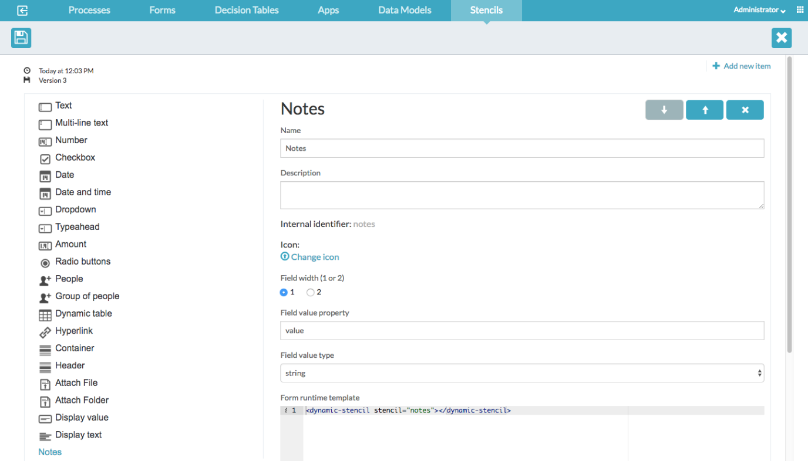

# Recursos Web Personalizados

Si desea agregar funciones adicionales de Javascript o anular reglas CSS, puede configurar una lista de recursos web adicionales que el navegador carga para cada aplicación de Process Service. Para ello, configure un nuevo recurso en la carpeta **tomcat/webapps/activiti-app**

A continuación se muestra un ejemplo de una nueva sección agregada al archivo **app-cfg.js** localizado en **tomcat/webapps/activiti-app/scripts**

```javascript
ACTIVITI.CONFIG.resources = {
    '*': [
        {
            'tag': 'link',
            'rel': 'stylesheet',
            'href': ACTIVITI.CONFIG.webContextRoot + '/custom/style.css?v=1.0'
        }
    ],
    'workflow': [
        {
            'tag': 'script',
            'type': 'text/javascript',
            'src': ACTIVITI.CONFIG.webContextRoot + '/custom/javascript.js?v=1.0'
        }
    ]
};
```

El objeto **ACTIVITI.CONFIG.resources** permite cargar distintos archivos para cada una de las aplicaciones Activiti utilizando sus nombres como clave para una lista de recursos adicionales que se cargarán; los distintos nombres de las aplicaciones son: **landing** , **analytics** , **editor** , **idm** y **workflow** . La clave * significa que se utilizará una lista de recursos predeterminada a menos que haya una clave de configuración específica para la aplicación que se cargará.

Por ejemplo, si un usuario ingresa a la aplicación de **editor** , con la configuración anterior implementada, **custom/style.css** sería el único recurso personalizado que se cargaría. Si un usuario ingresara a la aplicación de **workflow** , **custom/javascript.js** sería el único recurso personalizado que se cargaría. Por lo tanto, si el **workflow** también desea cargar custom/style.css , este deberá especificarse nuevamente dentro de la lista de recursos de **workflow**.

> **Nota**: Recuerde modificar el parámetro **v** cuando haya realizado cambios en sus archivos para evitar que el navegador utilice una versión en caché de su lógica personalizada.


# Ejemplo

En este ejemplo vamos a crear un formulario personalizado y utilizaremos  recursos personalizados

1. Creamos un nuevo formulario personalizado

2. Creamos un nuevo campo llamado **Notes**

3. Agregamos el siguiente contenido  al campo **Plantilla de tiempo de ejecución del formulario**

```html
<dynamic-stencil stencil="notes"></dynamic-stencil>
```

El fragmento actúa como un marcador de posición que luego se reemplaza dinámicamente por el contenido HTML definido en un archivo externo. (recurso web)




4. Guardamos el campo y formulario personalizado.

5. Creamos un formulario con la plantilla de formulario personalizado creado previamente.

6. Creamos un proceso que utilice el proceso.

7. Creamos una aplicación.

8. Publicamos la aplicación.

## Recursos web personalizados

Prepare un script para representar campos de formulario en función del contenido HTML ubicado en un archivo externo:

Cree un nuevo archivo llamado **dynamicStencil.js** con el siguiente contenido en la carpeta **tomcat/webapps/activiti-app/scripts/custom**:

```javascript
angular.module('activitiApp')
   .directive('dynamicStencil', function($rootScope, $compile) {
      return {
         template : '<div id="{{stencilName}}DynamicStencil" ng-include="getContentUrl()"></div>',
         link : function(scope, element, attrs) {
            scope.stencilName = attrs.stencil;
            scope.getContentUrl = function() {
               return scope.stencilName;
            }
         }
      };
});
```

Este fragmento define una directiva en AngularJS llamada **dynamicStencil** dentro del módulo **activitiApp**. La directiva permite incluir contenido dinámicamente en la página a partir de una URL que se determina a partir de un atributo. Veamos paso a paso:

---

### 1. Definición del módulo y la directiva

```javascript
angular.module('activitiApp')
   .directive('dynamicStencil', function($rootScope, $compile) {
```

- **angular.module('activitiApp')**: Se obtiene el módulo "activitiApp".
- **.directive('dynamicStencil', function($rootScope, $compile) { ... })**: Se define la directiva llamada `dynamicStencil`. Se inyectan los servicios `$rootScope` y `$compile` (aunque en este ejemplo, no se utilizan explícitamente, pero podrían servir para propósitos de compilación dinámica o comunicación global).

---

### 2. Configuración de la directiva

La función de la directiva retorna un objeto de configuración con dos propiedades principales: **template** y **link**.

#### a. Template

```javascript
template : '<div id="{{stencilName}}DynamicStencil" ng-include="getContentUrl()"></div>',
```

- **Template:**  
  - Se define una plantilla HTML que consiste en un `<div>`.
  - El **id** del div se genera dinámicamente usando interpolación (`{{stencilName}}`) concatenado con el sufijo `"DynamicStencil"`.
  - Se utiliza la directiva `ng-include` para incluir el contenido de otra plantilla o archivo. La URL del contenido se obtiene llamando a la función `getContentUrl()`.

#### b. Link Function

```javascript
link : function(scope, element, attrs) {
   scope.stencilName = attrs.stencil;
   scope.getContentUrl = function() {
      return scope.stencilName;
   }
}
```

- **Link function:**  
  - Se ejecuta una vez que la directiva ha sido compilada y enlazada al DOM.
  - **Parámetros:**
    - **scope:** El scope aislado o heredado para la directiva.
    - **element:** El elemento DOM al que se aplica la directiva.
    - **attrs:** Objeto que contiene los atributos del elemento.
  
- **scope.stencilName = attrs.stencil;**  
  - Se asigna al scope la propiedad `stencilName` utilizando el valor del atributo `stencil` definido en el HTML. Por ejemplo, si en el HTML se utiliza `<dynamic-stencil stencil="ruta/a/miPlantilla.html"></dynamic-stencil>`, entonces `stencilName` será `"ruta/a/miPlantilla.html"`.
  
- **scope.getContentUrl = function() { return scope.stencilName; }**  
  - Se define la función `getContentUrl()` en el scope, la cual devuelve el valor de `stencilName`.  
  - Esta función es utilizada por el `ng-include` en la plantilla para determinar la URL del contenido que se debe incluir dinámicamente.

---

### Resumen

La directiva **dynamicStencil** permite insertar contenido dinámico en el DOM mediante `ng-include`. El contenido a incluir se determina a partir del atributo **stencil** proporcionado en el HTML.  
- El **template** crea un `<div>` cuyo **id** se genera dinámicamente y utiliza `ng-include` para cargar el contenido.
- La **link function** asigna el valor del atributo `stencil` al scope (como `stencilName`) y define una función para devolver ese valor, que será la URL utilizada por `ng-include`.

De esta forma, puedes reutilizar la directiva para incluir diferentes fragmentos de contenido en función del atributo `stencil` que le pases.

Ahora agregamos el archivo **dynamicStencil.js** a la lista de recursos web adicionales que carga el navegador para una aplicación APS. Abrimos el archivo **app-cfg.js** y agregamos el siguiente fragmento al final del archivo:

```javascript
ACTIVITI.CONFIG.resources = {
'workflow' : [
   {
      'tag' : 'script',
      'type' : 'text/javascript',
      'src' : ACTIVITI.CONFIG.webContextRoot + '/scripts/custom/dynamicStencil.js?v=1.0'
   }
]};
```


Definimos la plantilla de ejecución del formulario real, abrimos el archivo **webapps/activiti-app/workflow/index.html** y agregamos la siguiente plantilla **ng-template** de **AngularJS** a la etiqueta del cuerpo:

```html
<!-- Dynamic Stencil Templates -->
<script type="text/ng-template" id="notes">
   <div ng-controller="notesController">
      <div class="input-group" style="width: 100%" ng-show="!(field.type === 'readonly')">
         <textarea class="form-control" rows="3" style="resize: none;" ng-model="currentNote" placeholder="Write some note ..."></textarea>
         <span class="input-group-addon btn btn-primary" ng-click="addNote()">
            <span class="glyphicon glyphicon-plus" aria-hidden="true"></span>
         </span>
      </div>
      <div class="list-group">
         <div ng-repeat="note in field.value | reverse track by $index" class="list-group-item list-group-item-action flex-column align-items-start active">
            <div class="d-flex w-100 justify-content-between">
               <small>{{note.fullName}} - {{note.date}}</small>
            </div>
            <p class="mb-1">{{note.content}}</p>
         </div>
      </div>
   </div>
</script>
```
Este fragmento define una plantilla de AngularJS que se utiliza de forma dinámica. Se explica a continuación cada parte:

---

### 1. Definición de la plantilla
```html
<script type="text/ng-template" id="notes">
   ...
</script>
```
- **type="text/ng-template"**: Indica que el contenido es una plantilla AngularJS que puede ser cargada dinámicamente mediante directivas como `ng-include` o al usar rutas en `ui-router`.
- **id="notes"**: Es el identificador de la plantilla, que se usará para referenciarla. Por ejemplo, podrías incluir esta plantilla en otro lugar usando `ng-include="'notes'"`.

---

### 2. Controlador de la plantilla
```html
<div ng-controller="notesController">
   ...
</div>
```
- La plantilla está gestionada por el controlador `notesController`, el cual se encarga de la lógica relacionada con las notas.

---

### 3. Sección para agregar nuevas notas
```html
<div class="input-group" style="width: 100%" ng-show="!(field.type === 'readonly')">
   <textarea class="form-control" rows="3" style="resize: none;" ng-model="currentNote" placeholder="Write some note ..."></textarea>
   <span class="input-group-addon btn btn-primary" ng-click="addNote()">
      <span class="glyphicon glyphicon-plus" aria-hidden="true"></span>
   </span>
</div>
```
- **ng-show="!(field.type === 'readonly')"**: Muestra este bloque solo si el campo no es de solo lectura. Se asume que `field` es una propiedad del scope que proviene de la integración con el formulario.
- **Textarea**: Permite escribir una nota. Su contenido se vincula a la variable `currentNote` mediante `ng-model`.
- **Botón (span con clases de Bootstrap)**: Al hacer clic, se llama a la función `addNote()`, definida en el controlador. Este botón probablemente añade la nota escrita a una lista.

---

### 4. Listado de notas
```html
<div class="list-group">
   <div ng-repeat="note in field.value | reverse track by $index" class="list-group-item list-group-item-action flex-column align-items-start active">
      <div class="d-flex w-100 justify-content-between">
         <small>{{note.fullName}} - {{note.date}}</small>
      </div>
      <p class="mb-1">{{note.content}}</p>
   </div>
</div>
```
- **ng-repeat="note in field.value | reverse track by $index"**: Recorre cada nota almacenada en `field.value`, que se espera sea un arreglo. Se usa un filtro `reverse` para mostrar las notas en orden inverso (por ejemplo, de la más reciente a la más antigua). Se utiliza `track by $index` para optimizar el proceso de renderizado.
- Cada elemento del listado es un `<div>` con clases de Bootstrap para estilizarlo como un ítem de lista.
- Dentro de cada ítem:
  - Se muestra un `<small>` con el nombre completo (`note.fullName`) y la fecha (`note.date`).
  - Se muestra un párrafo `<p>` con el contenido de la nota (`note.content`).

---

### Resumen

- **Plantilla dinámica:** La etiqueta `<script type="text/ng-template" id="notes">` define una plantilla que puede incluirse dinámicamente en la aplicación.
- **Controlador:** La plantilla utiliza el controlador `notesController` para gestionar la lógica.
- **Interfaz de usuario:**  
  - Se muestra un área de texto y un botón para agregar notas, pero solo si el campo no es de solo lectura.
  - Se lista dinámicamente cada nota almacenada en `field.value`, mostrando detalles como el nombre del autor, la fecha y el contenido de la nota.
- **Integración con AngularJS:** La plantilla utiliza directivas como `ng-show`, `ng-model`, `ng-click` y `ng-repeat` para manejar la interacción del usuario y la actualización dinámica del contenido.

Esta plantilla es un ejemplo de cómo se pueden combinar AngularJS y Bootstrap para crear interfaces interactivas dentro de un sistema como Alfresco/Activiti.

Tenga en cuenta que el ID de la plantilla ng-template debe ser el mismo que el definido en el atributo “stencil” en el paso 3.


Agregamos la lógica del controlador Angular para el campo de formulario creando un nuevo archivo **webapps/activiti-app/workflow/custom/notes-ctrl.js** con el siguiente contenido:

```javascript
function notesController($rootScope, $scope, $http, $filter) {

   var getDatetime = function() {
      return (new Date).toLocaleFormat("%A, %B %e, %Y");
   };

   // Registrar este controlador para escuchar los métodos de extensiones de formulario
   $scope.registerCustomFieldListener(this);

   // Anular el registro al destruir el formulario
   $scope.$on("$destroy", function handleDestroyEvent() {
      $scope.removeCustomFieldListener(this);
   });

   // Parse JSON string content
   if (!$scope.field.value) {
      $scope.field.value = [];
   } else if (typeof $scope.field.value === "string") {
      try {
         $scope.field.value = JSON.parse($scope.field.value);
      } catch (error) {
         $scope.field.value = [];
         console.error(error);
      }
   }

   // Se activará antes de que se guarde la tarea
   this.taskBeforeSaved = function(taskId, form, data, scope) {
     // Si se ingresó una nota pero el usuario no hizo clic en el botón "+", guarde la nota de todos modos
      $scope.addNote();
      // Guarde el contenido del campo del formulario como JSON
      data.values.notesfield = angular.toJson($scope.field.value);
   };

   // Se activará antes de que se complete el formulario
   this.formBeforeComplete = function(form, outcome, scope) {
      //Si se ingresó una nota pero el usuario no hizo clic en el botón "+", guarde la nota de todos modos
      $scope.addNote();
      // Guarde el contenido del campo del formulario como JSON
      $scope.field.value = angular.toJson($scope.field.value);
   };

   // Función de ámbito para agregar una nueva nota al ámbito
   $scope.addNote = function() {
      // Agrega la nota solo si no está indefinida ni vacía
      if ($scope.currentNote) {
         // Crea un nuevo objeto de nota
         var newNote = {
            "userID" : $scope.$root.account.id,
            "fullName" : $scope.$root.account.fullname,
            "date" : $filter("date")(new Date(), "dd.MM.yyyy HH:mm"),
            "content" : $scope.currentNote
         };
         // Agrega la nueva nota a la lista de notas
         $scope.field.value.push(newNote);
         // Limpia el campo de texto
         $scope.currentNote = "";
      }
   }

};

// Filtro que se utiliza para invertir el orden de las notas (obligar a que la nota más nueva esté en la parte superior de la lista)
function ReverseFilter() {
   return function(items) {
      if (items) {
         return items.slice().reverse();
      } else {
         return items;
      }
   };
}

angular.module('activitiApp').filter('reverse', ReverseFilter).controller('notesController', notesController);
```


Agregamos este archivo controlador a la lista de web resources. Agregamos una nueva entrada al archivo **app-cfg.js**.

```javascript
ACTIVITI.CONFIG.resources = {
   'workflow' : [
      {
         'tag' : 'script',
         'type' : 'text/javascript',
         'src' : ACTIVITI.CONFIG.webContextRoot + '/scripts/custom/dynamicStencil.js?v=1.0'
      },
      {
         'tag' : 'script',
         'type' : 'text/javascript',
         'src' : ACTIVITI.CONFIG.webContextRoot + '/workflow/custom/notes-ctrl.js?v=1.0'
      }
   ]
};
```

Este enfoque es útil para realizar pruebas ya que permite una carga dinamica. Se evita estar publicando el proceso.

> Nota: Para que funcione hay que cambiar las versiones de los scripts. En `index.html` cambiar la version de carga de `app-cfg.js` (`<script src="../scripts/app-cfg.js?v=X"></script>`) donde X es la version. Igualmente para los scripts personalizados.

