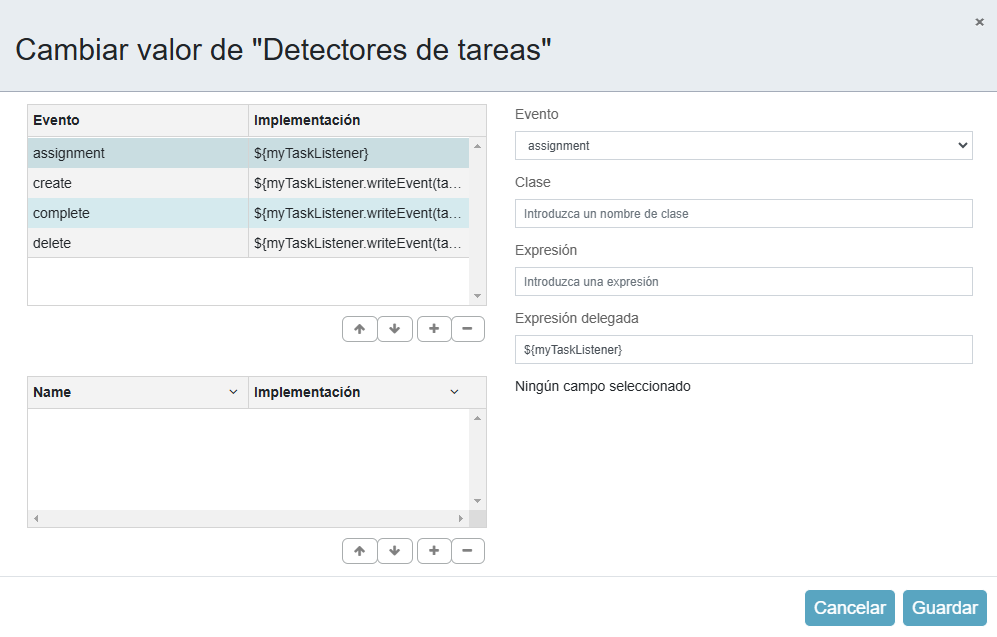

# Listeners

Un listener es una operación que escucha eventos activados por el motor de proceso y ejecuta código Java externo o evalúa una expresión cuando ocurre un evento específico. Un listener de cualquier tipo es una pieza de lógica que se puede utilizar con fines técnicos. Los listener se adjuntan a varios puntos del proceso BPMN que coinciden con eventos específicos.

Los listener están configurados para escuchar un evento o eventos específicos, como el ``inicio de un proceso`` o la ``finalización de una tarea``, y luego ejecutar alguna operación que el evento ha desencadenado.

Alfresco Activiti ofrece varios tipos diferentes de oyentes que pueden implementarse para lograr sus objetivos. Estos distintos tipos de listeners le permiten escuchar eventos específicos y utilizar lenguajes de programación de eventos para su lógica. D


## Execution Listeners

Los "execution listeners" permiten ejecutar código cuando ocurren eventos durante la ejecución de un proceso. Estos eventos pueden originarse a partir de tareas, transiciones e incluso del propio proceso. Un desarrollador que escriba sus listeners utilizando código Java debe implementar la interfaz de "execution listener" y luego su clase Java puede ser configurada como un "execution listener" dentro del Diseñador de Procesos BPMN.

Dentro del diseñador de procesos, puedes seleccionar el evento específico al que tu listener debe escuchar, los cuales son eventos de inicio, fin o toma.

El evento de inicio se dispara solo al iniciar un proceso o tarea, y el evento de fin se dispara al completar los mismos. Sin embargo, el evento de toma es único, ya que solo se refiere a transiciones; por lo tanto, la tarea o el proceso solo emiten eventos de inicio y fin, mientras que las transiciones solo emiten eventos de toma.

Los eventos que se pueden capturar son:

- Inicio y final de una instancia de proceso.

- Tomando una transición(en las flechas).

- Inicio y fin de una actividad.

- Inicio y final de un gateway.

- Inicio y fin de intermediate events.

- Finalizar un evento de inicio o iniciar un evento de finalización.


### Demostración Java class

El executionListener va a estar definido en el evento de partida.

```java
package pe.com.domain.delegate;

import org.activiti.engine.delegate.ExecutionListener;
import org.activiti.bpmn.model.FlowElement;
import org.activiti.engine.delegate.DelegateExecution;

public class JavaExecutionListener implements ExecutionListener{
    @Override
    public void notify(DelegateExecution delegateExecution){
        final String currentActivityId = delegateExecution.getCurrentActivityId();
        String activityName = null;
        FlowElement FlowElement = delegateExecution.getCurrentFlowElement();
        activityName = FlowElement.getName();
        System.out.println("Starting the '" + activityName + "' -> " + currentActivityId + ", activity." );
    }
}
```


### Demostración Spring class

El executionListener va a estar definido en el evento final.

```java
package com.activiti.extension.bean;

import org.activiti.engine.delegate.ExecutionListener;
import org.activiti.bpmn.model.FlowElement;
import org.activiti.engine.delegate.DelegateExecution;
import org.springframework.stereotype.Component;

@Component("myExecutionListener")
public class SpringExecutionListener implements ExecutionListener{
    @Override
    public void notify(DelegateExecution delegateExecution){
        final String currentActivityId = delegateExecution.getCurrentActivityId();
        String activityName = null;
        FlowElement FlowElement = delegateExecution.getCurrentFlowElement();
        activityName = FlowElement.getName();
        System.out.println("Ending the '" + activityName + "' -> " + currentActivityId + ", activity." );
    }

    public void writeMessage(DelegateExecution delegateExecution, String message){
        final String currentActivityId = delegateExecution.getCurrentActivityId();
        String activityName = null;
        FlowElement FlowElement = delegateExecution.getCurrentFlowElement();
        activityName = FlowElement.getName();
        System.out.println(activityName +" with id : " + currentActivityId + " says, '" + message + "'");
    }
}
```


En el flujo de secuencia se define el evento ``take`` o ``Adquirir`` y utilizamos writeMessage que es un metodo definido en un Spring bean. 


```
${myExecutionListener.writeMessage(execution," Transition ")}
```
[proceso implementado](./processes/ExecutionListeners.bpmn20.xml)

## Task Listeners

Los "task listeners" presentan algunas diferencias: solo pueden aplicarse a una tarea de usuario. Al programar en Java, deben implementar la interfaz de "task listener". Puedes considerar los "task listeners" como una especie de listener especializado que atiende a un conjunto específico de eventos.

Los "task listeners" pueden escuchar cuatro tipos de eventos:

create (crear) :  Ocurre cuando la tarea ha sido creada y todas las propiedades de la tarea están establecidas.
assignment (asignación) : Ocurre cuando la tarea se asigna a un usuario, pero antes del evento create.
complete (completar) :   Ocurre cuando la tarea se completa y justo antes de ser eliminada.
delete (eliminar) : Ocurre justo antes de que la tarea vaya a ser eliminada.


### Demostración

```java
package com.activiti.extension.bean;

import org.activiti.engine.delegate.DelegateTask;
import org.activiti.engine.delegate.TaskListener;
import org.springframework.stereotype.Component;

@Component("myTaskListener")
public class SpringTaskListener implements TaskListener{
    @Override
    public void notify(DelegateTask delegateTask){
        final String assignee = delegateTask.getAssignee();
        final String name = delegateTask.getName();
        System.out.println( name + "has been assigned to ID '"+ assignee + '\'');
    }

    public void writeEvent(DelegateTask delegateTask){
        System.out.println( delegateTask.getName()+ " event '" + delegateTask.getEventName() + '\'');
    }
}
```




[proceso implementado](./processes/taskListeners.bpmn20.xml)

## Otros Listeners

Si bien la mayoría de los problemas pueden resolverse utilizando "execution listeners" o "task listeners", Alfresco Activiti admite otros tipos de listeners que cubren casos de uso más específicos.

Por ejemplo, existen los "script listeners", los listeners de inicio de sesión y cierre de sesión ("log-in y log-out listeners"), así como los listeners de eventos del motor de procesos ("process engine event listeners").

### Listeners de scripts (Script Listeners)

Alfresco Activiti admite el uso de "script listeners" tanto para "execution listeners" como para "task listeners". Esto se logra utilizando la clase "script execution listener" y la clase "script task listener"

Estas clases requieren un campo de "script" y un campo de "language", que contienen el código del script y el tipo de lenguaje, respectivamente. Opcionalmente, se puede especificar un nombre de variable de retorno que contendrá el valor devuelto por el script.

#### Script Task Listener


``
org.activiti.engine.impl.bpmn.listener.ScriptTaskListener
``

```javascript
print("Script Task Listener Event: " + task.eventName);
```

Ejecución de Script


``
org.activiti.engine.impl.bpmn.listener.ScriptTaskListener
``

```javascript
print("Script Task Listener Event: " + task.eventName);
```

[proceso implementado](./processes/ScriptTaskListener.bpmn20.xml)

#### Script Execution Listener


``
org.activiti.engine.impl.bpmn.listener.ScriptExecutionListener
``

```javascript
print("Script Execution Listener Event: " + execution.eventName );
```


### Listeners de inicio y cierre de sesión (Log-in y Log-out Listeners)

Estos listeners especializados permiten recibir una notificación cuando un usuario inicia o cierra sesión en Alfresco Activiti. La implementación del método correspondiente recibirá un objeto de usuario que representa al usuario que ha iniciado o cerrado sesión. 


### **Interfaz de usuario vs Programación**

revisaremos los diferentes enfoques que puedes tomar para implementar listeners en Alfresco Activiti. Como ya sabes, existen muchos tipos diferentes de listeners disponibles para construir y extender tu proceso BPMN. Sin embargo, solo hay dos paradigmas distintos para crearlos: programando en Java o utilizando la interfaz de usuario de Alfresco Activiti. 

Los listeners pueden agregarse a las entidades BPMN desde el editor visual de Alfresco Activiti. Simplemente selecciona la propiedad **execution listeners** o **task listeners** de cualquier entidad BPMN para abrir un cuadro de diálogo donde puedes configurarlo.

Ahí puedes agregar uno o más listeners que escucharán ciertos eventos que ocurren durante el ciclo de vida de la entidad.

Cuando se activa el evento, el listener ejecutará una acción personalizada, la cual también puedes definir en este diálogo. El código de tu acción personalizada puede escribirse como una **expresión** o a través de un **script listener**.

### **Beneficios del enfoque basado en la UI**
- Ideal para operaciones pequeñas que requieren de una a tres líneas de código.
- No es necesario desplegar código ni reiniciar el servidor.
- Permite una implementación rápida.

### **Desventajas del enfoque basado en la UI**
- Las tareas más grandes son difíciles de crear y mantener.
- Es complicado depurar problemas a medida que aumenta la complejidad.
- No permite realizar pruebas unitarias.

---

### **Programación en Java**
También puedes escribir el código de tu listener personalizado dentro de una clase y empaquetarlo en un **archivo JAR**, que será cargado por Alfresco Activiti en el arranque. Aunque los listeners pueden crearse programando en Java, sigue siendo necesario usar la interfaz de usuario de Alfresco Activiti para adjuntar el listener Java a una entidad BPMN. Sin embargo, el código personalizado se escribe como una **clase Java** dentro de un **IDE**, en lugar de hacerlo directamente en la interfaz de usuario de Alfresco Activiti. 

Los únicos pasos que debes realizar en la UI son:
1. Especificar el evento al que el listener debe responder.
2. Indicar el nombre completo de la clase Java que contiene el listener.

### **Beneficios del enfoque basado en Java**
- Es intuitivo para desarrolladores de Java.
- Facilita la gestión de acciones y operaciones más complejas.
- Permite realizar **pruebas unitarias** y depuración del código.

### **Desventajas del enfoque basado en Java**
- Para tareas simples, hay un exceso de código repetitivo (boilerplate).
- Los cambios en el código requieren **redeployment** y reinicio del servidor.
- Tiene una **curva de aprendizaje alta** para desarrolladores que no están familiarizados con Java.


## Event Listeners

El proceso en general tiene listeners de eventos especificos:


```java

package pe.com.domain.delegate;

import org.activiti.engine.delegate.event.ActivitiEvent;
import org.activiti.engine.delegate.event.ActivitiEventListener;

public class JavaEventListener implements ActivitiEventListener{
    @Override
    public void onEvent(ActivitiEvent activitiEvent){
        System.out.println("Spring Process Event: " + activitiEvent.getType());
    }
    @Override
    public boolean isFailOnException(){
        return false;
    }
}
```


```java

package com.activiti.extension.bean;

import org.activiti.engine.delegate.event.ActivitiEvent;
import org.activiti.engine.delegate.event.ActivitiEventListener;
import org.springframework.stereotype.Component;

@Component("myEventListener")
public class SpringEventListener implements ActivitiEventListener{
    @Override
    public void onEvent(ActivitiEvent activitiEvent){
        System.out.println("Spring Process Event: " + activitiEvent.getType());
    }
    @Override
    public boolean isFailOnException(){
        return false;
    }
}
```
Estos listeners te permiten ejecutar lógica personalizada en respuesta a eventos generados por el motor de procesos durante la ejecución de flujos de trabajo.
Ya que es un spring bean este se carga automaticamente y se ejecutará para todos los procesos ya que siempre retorna true del metodo isEnabled.

```java

package com.activiti.extension.bean;

import com.activiti.service.runtime.events.RuntimeEventListener;
import org.activiti.engine.delegate.event.ActivitiEvent;
import org.springframework.stereotype.Component;

@Component
public class MyRuntimeListener implements RuntimeEventListener{
    @Override
    public boolean isEnabled(){
        return true;
    }
    @Override
    public void onEvent(ActivitiEvent activitiEvent){
        System.out.println("Runtime Event: " + activitiEvent.getType());
    }
    @Override
    public boolean isFailOnException(){
        return false;
    }
}
```

En Alfresco Process Services 24.x (y en Activiti), el método isFailOnException() en un listener de eventos (RuntimeEventListener) indica si una excepción lanzada dentro del listener debe hacer que la ejecución del proceso falle.
* Si isFailOnException() retorna true, cualquier excepción no controlada en el listener provocará que la ejecución del proceso falle y se detenga.
* Si retorna false, las excepciones lanzadas en el listener serán ignoradas y el proceso continuará normalmente.

Esto te permite decidir si los errores en la lógica del listener deben afectar el flujo del proceso o no. Por lo general, se deja en false para evitar que errores en la auditoría, logging u otras tareas secundarias interrumpan el proceso principal.

> **Nota**:
- Clase:  implementación Java que define la lógica personalizada que se ejecutará en un punto específico del proceso.
- Expresión Delegada : Una Expresión Delegada es una forma de definir la lógica de ejecución utilizando expresiones que se resuelven en tiempo de ejecución. Estas expresiones suelen utilizar el lenguaje de expresiones de Java Unified Expression Language (UEL) y permiten una mayor flexibilidad al referenciar beans de Spring o métodos específicos sin necesidad de codificar una clase completa.
- Expresión: Una Expresión en APS es una construcción que se evalúa en tiempo de ejecución y puede devolver un valor. Las expresiones se utilizan en diversas partes del proceso, como en condiciones de flujo, asignaciones de tareas o para definir valores de variables. Al igual que las expresiones delegadas, suelen basarse en UEL y pueden acceder a variables del proceso, beans de Spring y otros componentes del contexto de ejecución.
- Tipo de entidad: El Tipo de Entidad se refiere a las diferentes componentes o elementos que conforman un proceso BPMN en APS. Cada entidad tiene un propósito y comportamiento específicos dentro del flujo del proceso. Principales tipos de entidades:

    - Tareas de Usuario: Representan actividades que requieren la intervención humana.
    - Tareas de Servicio: Ejecutan lógica automatizada, como llamar a un servicio web o ejecutar una clase Java.
    - Eventos: Marcan puntos significativos en el proceso, como el inicio o fin del mismo, o eventos intermedios que manejan interrupciones o demoras.
    - Puertas de Enlace (Gateways): Controlan el flujo del proceso, determinando caminos divergentes o convergentes basados en condiciones definidas.