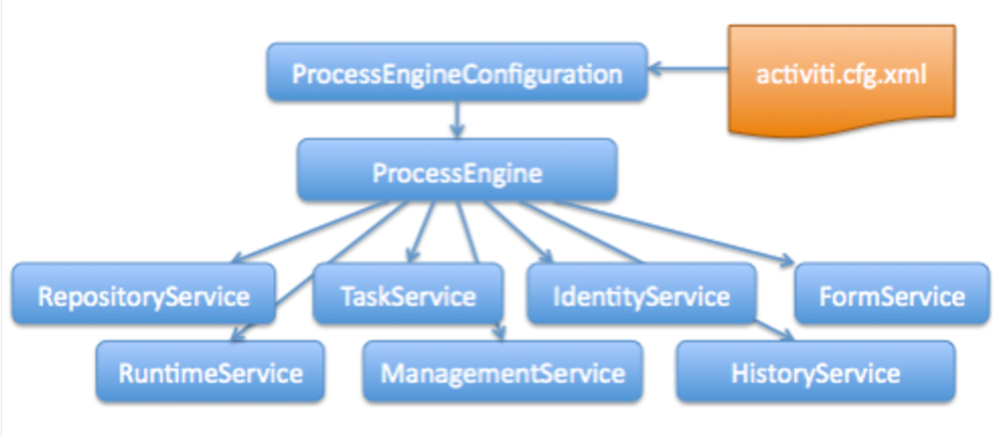

# Service Task

Se utiliza para:
    - Invocar código java
    - ejecutar un expresión
por ejemplo llamar un ``Spring bean`` o ``Java Delegate``.

## Prerrequisitos

```xml
<dependencies>
    <dependency>
        <groupId>com.activiti</groupId>
        <artifactID>activiti-app-logic</artifactID>
        <version>${suite.version}</version>
    </dependency>
</dependencies>

```

### Java Delegates

Ejemplo : 
```java
package my.company;

import org.activiti.engine.delegate.DelegateExecution;
import org.activiti.engine.delegate.JavaDelegate;

public class MyJavaDelegate implements JavaDelegate  {

   public void execute (DelegateExecution execution)throws  Exception {
        System.out.println("Hello from the class delegate");
        execution.setVariable("var1","Hello from the class delegate");
    }

}
```

Para utilizarlo en APS debemos usar fully qualified classname en la sección de Service Task , propiedad class:  my.comany.MyJavaDelegate

### Spring Beans

Ejemplo:
```java
package com.activiti.extension.bean;

import org.springframework.stereotype.Component;
import org.activiti.engine.delegate.DelegateExecution;
@Component("helloWorldBean")
public class HelloWorldBean{
    public void sayHello(DelegateExecution execution){
        System.out.println("Hello from " +  this );
        execution.setVariable("var3", "from the bean");

    }
}
```

Para utilizarlo en APS debemos usar fully qualified classname en la sección de Service Task, propiedad expresión:  ${helloWorldBean.sayHello(execution)}


### Enfoque personalizado de configuración java

Utilizado para compartir dependencias entre los beans y configuración compleja de un bean.

```java
 package com.activiti.extension.conf;

 import org.springframework.context.annotation.Bean;
 import org.springframework.context.annotation.Configuration;

 @Configuration 
 public class CustomConfiguration{

     @Bean 
     public  SomeBean  someBean () {
         return   new  SomeBean();
    }
}
```

```java
package com.activiti.extension.conf;

public class SomeBean {
    private int value = 0; 

        public SomeBean() {
            // Default constructor
        }

        // Add getter and setter
        public int getValue() {
            return value;
        }

        public void setValue(int value) {
            this.value = value;
        }
}

```
Este se puede inyectar en un bean que puede ser llamado en un service task

```java
package com.activiti.extension.bean;

import org.springframework.beans.factory.annotation.Autowired;
import org.springframework.stereotype.Component;

import com.activiti.extension.conf.SomeBean;

@Component("helloWorldBeanWithInjection")
public class HelloWorldBeanWithInjection {

    @Autowired
    private SomeBean someBean;

    public void sayHello() {
        System.out.println(someBean.getValue());
    }
}
```
propiedad expresión:  ${helloWorldBeanWithInjection.sayHello()}


[Proceso implementado](./processes/Task%20Services.bpmn20.xml)
### ProcessEngine API

tiene las siguientes características:

- Puede obtener los distintos servicios que contienen los métodos de flujo de trabajo/BPM.
- Los objetos de servicios son seguros para subprocesos.
- Al ser seguros para subprocesos, puede mantener una referencia a uno de ellos para todo un servidor.

Hay cinco servicios que se aplican al APS y son:

1. RepositoryService: Despliegue, consulta, eliminación, recuperación
2. TaskService: Consultar tareas, crear nuevas tareas independientes, manipular a qué usuario se le asigna una tarea, reclamar una tarea completa
3. ManagementService: consultar las tablas de Activiti, ejecutar trabajos.
4. HistoryService: Horas de inicio de las instancias de proceso, Quién realizó qué tareas en un proceso, Cuánto tiempo llevó completar una tarea, Qué ruta se siguió en cada instancia de proceso
5. RuntimeService: Iniciar nuevas instancias de proceso de definiciones de proceso, Recuperar y almacenar variables de proceso

[mayor información](https://www.activiti.org/userguide/index.html#chapterApi)


El código Java que necesitarás escribir para llamar a cada servicio se detalla en el siguiente ejemplo:

```java
ProcessEngine processEngine = ProcessEngines.getDefaultProcessingEngine();

RuntimeService runtimeService = processEngine.getRuntimeService();
RepositoryService repositoryService = processEngine.getRepositoryService();
TaskService taskService = processEngine.getTaskService();
ManagementService managementService = processEngine.getManagementService();
IdentityService identityService = processEngine.getIdentityService();
HistoryService historyService = processEngine.getHistoryService();
FormService formService = processEngine.getFormService();
```

Ahora:
```java
import org.activiti.engine.impl.context.Context;
Context.getProcessEngineConfiguration().getRuntimeService();
```




### Expresiones

Las expresiones pueden ser usadas en:

- Java Service tasks
- Execution Listeners
- Task Listeners
- Conditional sequence flows


#### Value Expression

- se resuelve en un valor
- Todas las variables de proceso están disponibles para su uso en expresiones de valor.
- Todos los beans spring están disponibles para usarse en expresiones Value

```
${myVar}

${myBean.myProperty}
```
#### Method Expression

invoca un método con o sin parámetros

> **Nota**: Al invocar un método con parámetros, agregue paréntesis vacíos () después del nombre del método
Los parámetros pasados ​​pueden ser valores literales o expresiones

```
${printer.print()} 

${myBean.addNewOrder('orderName')} 

${myBean.doSomething(myVar, execution)}
```


## Lista blanca de Bean

De forma predeterminada, puede especificar cualquier bean de Spring para utilizarlo en una expresión. Si bien esto facilita su uso (ya que cualquier bean que desarrolle se analizará automáticamente como se describió anteriormente), también aumenta las posibilidades de uso indebido y amenazas de seguridad. Para ayudar a evitar que ocurran estos problemas, puede incluir en la lista blanca los beans de Spring haciendo los siguientes cambios:

1. <InstallLocation>/tomcat/lib/activiti-app.properties

2. Localiza la propiedad y establezca beans.whitelisting.enabled en verdadero. (falso por defecto)

```properties
 beans.whitelisting.enabled=true
```

3. Para incluir los Spring beans, en la lista blanca se utiliza el siguiente archivo:

```
 activiti-app/WEB-INF/classes/activiti/beans-whitelist.conf
```

### Ejemplo de uso de whitelisting


Para utilizar una variable ``userCount`` en un campo de texto para mostrar, ``${userCount}``, agregue la siguiente línea en la propiedad Expression dentro de una tarea de servicio:
```
${execution.setVariable('userCount', userService.getUserCount())}
```
Si beans.whitelisting.enabled está configurado en false o la propiedad no está disponible, el proceso se completa y el campo de texto para mostrar debe mostrar el valor de la variable usercount.

Para completar el proceso con éxito utilizando la lista blanca de beans, debe configurar beans.whitelisting.enabled en true y agregar el nombre del bean a beans-whitelist.conf:

```properties
# list beans names that should be whitelisted
userService
```


## Lista blanca de clases de ServiceTask

Esto proporciona una alternativa a la inclusión en listas blancas de beans que permite un control más detallado sobre lo que un desarrollador puede ejecutar. Por ejemplo, puede configurar qué patrones permite ejecutar mediante expresiones.

También puede incluir en la lista blanca nombres de clase completos o patrones de paquete como ``com.activiti.*``.

Para incluir en la lista blanca las clases de tareas de servicio, haga lo siguiente:

1. Abra el archivo <InstallLocation>/tomcat/lib/activiti-app.properties.
2. Busque y establezca service.task.class.whitelisting.enabled en true (falso por defecto)

```
class.whitelisting.enabled=true
```
3. Este paso se aplica solo a los usuarios de la versión 1.6.0 a 1.6.2 de Process Services, así como a las aplicaciones publicadas en estas versiones. La inclusión en listas blancas para tareas de publicación está exenta de la versión 1.6.3. Para usar Alfresco, Box o Google Drive para publicar tareas con la lista blanca de tareas de servicio habilitada, agregue las siguientes entradas a activiti-app/WEB-INF/classes/activiti/whitelisted-classes.conf:

```properties
com.activiti.runtime.activiti.bean.BoxStepActivityBehavior
com.activiti.runtime.activiti.bean.GoogleDriveStepActivityBehavior
com.activiti.runtime.activiti.KickstartAlfrescoPublishDelegate
com.activiti.runtime.activiti.KickstartAlfrescoCloudPublishDelegate
```

## Lista blanca de lenguajes de scripts

Para incluir en la lista blanca los lenguajes de scripts que, por ejemplo, se pueden usar en tareas de scripts como JavaScript, juel y groovy, agregue los tipos de scripts en activiti-app/WEB-INF/classes/activiti/whitelisted-scripts.conf:

```properties
# Aquí puede especificar qué tipos de scripts se pueden ejecutar
javascript
js
ecmascript
groovy
juel
```

> **Nota**: La configuración de la lista blanca afecta a cualquier tipo de ejecución de scripts, ya sea que se trate de tareas de scripts o cualquier otra situación en la que se pueda usar un script. Tenga en cuenta también que esto se verifica en tiempo de ejecución. Si un lenguaje de scripts no está en la lista blanca, la tarea o actividad relacionada no se ejecutará.


## Lista blanca de clases en JavaScript

También puede configurar la lista blanca para las clases de JavaScript que están disponibles para su uso en JavaScript. Los siguientes pasos le muestran cómo hacerlo. Sin embargo, solo son aplicables si ha habilitado la creación de scripts seguros para JavaScript. Este será el caso si ha establecido la propiedad javascript.secure-scripting.enabled en true:
```
javascript.secure-scripting.enabled=true
```

1. Abra el archivo <InstallLocation>/tomcat/lib/activiti-app.properties.
2. Busque y establezca javascript.secure-scripting.enable-class-whitelisting en true.
    ```
    javascript.secure-scripting.enable-class-whitelisting = true
    ```
3. Para permitir la ejecución de clases de JavaScript, agréguelas a activiti-app/WEB-INF/classes/activiti/javascript-whitelist-classes.conf:
    ```
    java.lang.System
    java.util.ArrayList
    org.apache.tomcat.util.log.SystemLogHandler
    ```
> **Nota**: La habilitación de scripts seguros para clases de Java utilizadas en JavaScript se activa cuando la configuración falta en el archivo de propiedades o está comentada.